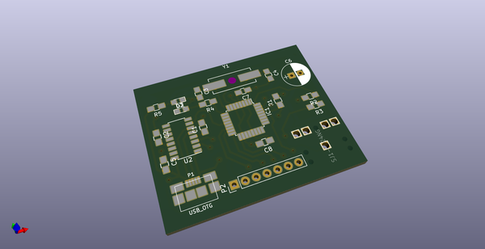
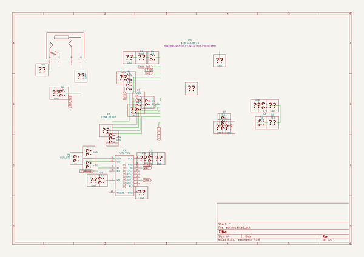
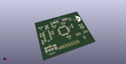
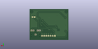
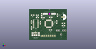

# OOMP Project  
## bullion  by coddingtonbear  
  
(snippet of original readme)  
  
- USB & SPI Interface for FS9721-based Multimeter (Bullion)  
  
  
  
Do you have a cheap Chinese multimeter using the FS9721 chipset and  
want to add an easy-to-use USB interface to it?  Or, do you have an  
arduino project in mind where you might want to collect measurements  
from your multimeter?  This project can help you do both of those things.  
  
-- Compatible Multimeters  
  
Any multimeter using the FS9721 chipset is compatible, but you may have  
to adapt the hardware design herein if your multimeter does not have a  
3.5mm stereo jack labeled "RS232".  
  
Known-compatible multimeters include:  
  
* **RECOMMENDED** [TekPower TP4000ZC](https://www.amazon.com/Tekpower-TP4000ZC-Interfaced-Multimeter-Computer/dp/B000OPDFLM)  
    * Also available as the Digitek DT-4000ZC.  
    * Includes a 3.5mm RS232 port.  
* [Mastech V&A 18B](https://www.amazon.com/Manual-Ranging-Digital-Multimeter-Interface/dp/B000LQONYM)  
    * Does have an external RS232 port, but it is not compatible with the  
      hardware files you'll find herein.  You will have to improvise.  
* [UNI-T UT60E](https://www.amazon.com/UNI-T-UT60E-Precise-Light-Weight/dp/B0152OJAWC)  
    * Does have an external RS232 port, but it is not compatible with the  
      hardware files you'll find herein.  You will have to improvise.  
  
-- Interfaces  
  
--- USB  
  
* Baud Rate: 2400  
  
When connected to your PC, the device will appear as an additional serial  
port (may require installation  
  full source readme at [readme_src.md](readme_src.md)  
  
source repo at: [https://github.com/coddingtonbear/bullion](https://github.com/coddingtonbear/bullion)  
## Board  
  
  
## Schematic  
  
  
  
[schematic pdf](working_schematic.pdf)  
## Images  
  
  
  
  
  
  
