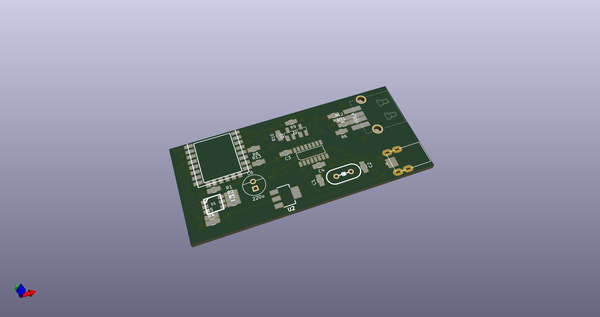
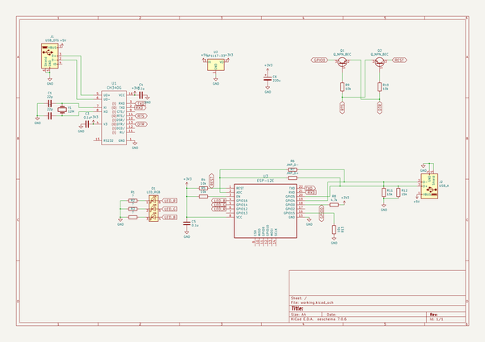
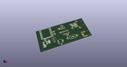
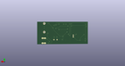
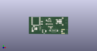

# OOMP Project  
## gopro-dashcam-tender  by coddingtonbear  
  
oomp key: oomp_projects_flat_coddingtonbear_gopro_dashcam_tender  
(snippet of original readme)  
  
  
  
  
I use my GoPro as a dashcam, and although I rarely need to take any footage  
off of my device, the GoPro will slowly accumulate videos over time.  This  
device provides an easy way for me to clear the GoPro at the end of the   
day by just plugging my GoPro into it as its charger.  
  
-- Components Required  
  
In order of decreasing expense:  
  
* 1x ESP-12F: These can be obtained for roughly $2 on AliExpress.  Other similar packages of the ESP8266 wifi module, or _maybe_ even the ESP-01 module should work with minimal modifications to the layout and schematic.  
* 1x CH340G: ~$0.50 on AliExpress.  
* 1x SOT-223 3.3V Voltage Regulator  
* 2x SOT-23 NPN Transistors for the UART->ESP8266 reset circuit.  Note that there are alternative reset circuits.  See below for details.  
* 1x HC-49 12MHz crystal  
* Miscellaneous passives.  
  
See the schematic's netlist for more details.  
  
-- Procedure  
  
Essentially, what this device does is:  
  
* Wait for a GoPro to be plugged-in to the USB-A port.  This can be detected because of the way connected USB devices pull up the D+/D- lines to indicate their operating speed.  
* Connect to my home WIFI network to get an up-to-date UTC time using NTP.  Immediately disconnecting from my home WIFI network.  
* Connect to the GoPro WIFI network, then:  
  * Set the GoPro's time.  
  * Clear all stored media.  
  * Turn off the GoPro.  
  
-- Schematic  
  
  
  
source repo at: [https://github.com/coddingtonbear/gopro-dashcam-tender](https://github.com/coddingtonbear/gopro-dashcam-tender)  
## Board  
  
  
## Schematic  
  
  
  
[schematic pdf](working_schematic.pdf)  
## Images  
  
  
  
  
  
  
