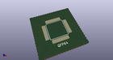
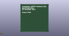
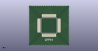

# OOMP Project  
## kicad-castellated-breakouts  by coddingtonbear  
  
oomp key: oomp_projects_flat_coddingtonbear_kicad_castellated_breakouts  
(snippet of original readme)  
  
- Castellated Breakouts for KiCad  
  
  
  
Do you own a milling machine that isn't _quite_ precise enough for that  
0.5mm-pitch IC you want to use?  Maybe you like to home-etch your PCBs,  
but you haven't quite worked out a way of consistently exposing tiny  
0.2mm traces?  The board designs and footprints in this repository  
can help you continue to develop your bespoke hand-crafted electronics  
projects at home by letting PCB board houses handle the parts of your  
design that are just a little too difficult to be worth fighting with  
on your own.  
  
Each board in this repository can be plotted in KiCad and sent off to your  
favorite board house (OshPark links are provided below) so you can have  
boards for your favorite ICs readily-available for the next time you'd  
like to use them in a design.  
  
-- Boards  
  
--- QFP64 (0.5mm pitch)  
  
<a href="https://oshpark.com/shared_projects/qaabAuOa"></img></a>  
  
  
  
* IC Pin Pitch: 0.5mm  
* Compatible packages: QFP64 (BQFP64, CQFP64, LQFP64, TQFP64, etc).  No  
  center pad.  
* Castellation Pitch: 1.27mm  
* Board Files: [qfp64_0.5mm](qfp64_0.5mm)  
  
--- QFP48 (0.5mm pitch)  
  
<a href="htt  
  full source readme at [readme_src.md](readme_src.md)  
  
source repo at: [https://github.com/coddingtonbear/kicad-castellated-breakouts](https://github.com/coddingtonbear/kicad-castellated-breakouts)  
## Board  
  
  
## Schematic  
  
  
  
[schematic pdf](working_schematic.pdf)  
## Images  
  
  
  
  
  
  
