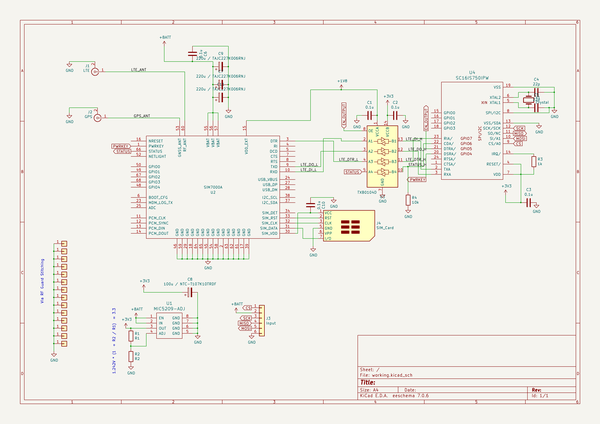

# OOMP Project  
## maxwell  by coddingtonbear  
  
(snippet of original readme)  
  
- Maxwell: Bicycle Electrification  
  
  
  
See my little blog post about this here: [http://coddingtonbear.net/maxwell-bicycle-electrification/](http://coddingtonbear.net/maxwell-bicycle-electrification/).  
  
I have a bicycle dynamo on my bike, a rudimentary understanding of electronics, and a bunch of neopixels, gps, and bluetooth modules to use.  This is what happens when those things combine.  
  
Maxwell is a two-part bike computer I've designed to allow me to do a few things:  
  
* Light and control neopixel LEDs wrapped around my bike for added safety while biking at night, and added fun when biking with groups.  
* Charge an easily-swappable 18650 Li-On cell for potential use when bike touring.  
* Gather and transmit GPS coordinates for display on the internet somewhere.  
* Display status information including my current speed, battery voltage, and current consumption, as well as disable or enable bike features including, most importantly, disabling and enabling the LEDs from a small screen mounted at the front of the bike.  
* Send interesting data for display on the internet for completely impractical reasons.  
  
The "remote" unit is based around the STM32F103CB microcontroller, and the "base" unit is based around its slightly-more-full-featured brother, the STM32F103RE.  Both communicate with one another over a CANBus (routed through two of the conductors in a length of ethernet cable) to shar  
  full source readme at [readme_src.md](readme_src.md)  
  
source repo at: [https://github.com/coddingtonbear/maxwell](https://github.com/coddingtonbear/maxwell)  
## Board  
  
  
## Schematic  
  
  
  
[schematic pdf](working_schematic.pdf)  
## Images  
  
  
  
  
  
  
