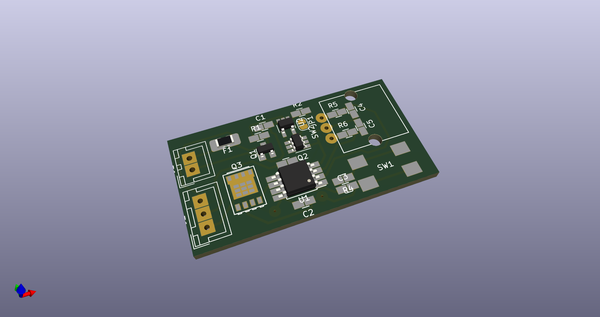
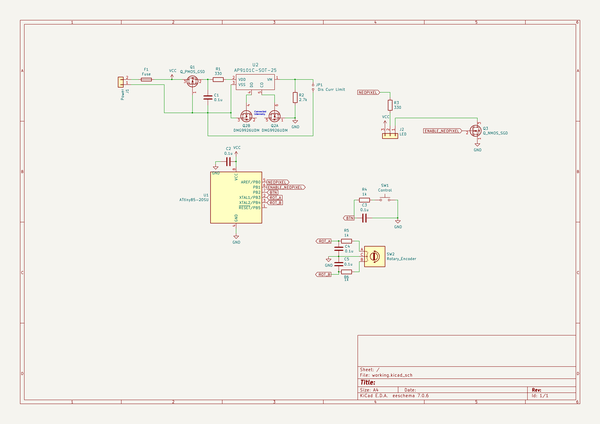
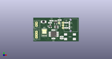

# OOMP Project  
## molotok  by coddingtonbear  
  
oomp key: oomp_projects_flat_coddingtonbear_molotok  
(snippet of original readme)  
  
- Molotok: ATtiny85-based WS2812b Controller  
  
I wake up both way before my partner and way before sunrise most mornings and need to see in my wardrobe to pick out clothes for the day.  
To do this, I have to carefully aim my phone's flashlight into the closet, and, given that the process of putting on clothes generally requires that I have free hands, I've dropped my phone many times making a great deal of partner-waking noise.  
So, I thought, why don't I fix this? I know I have at least a meter of neopixels available; can't basically any problem be fixed with a microcontroller and a bunch of leds?  This is that.  
  
  full source readme at [readme_src.md](readme_src.md)  
  
source repo at: [https://github.com/coddingtonbear/molotok](https://github.com/coddingtonbear/molotok)  
## Board  
  
  
## Schematic  
  
  
  
[schematic pdf](working_schematic.pdf)  
## Images  
  
  
  
  
  
  
