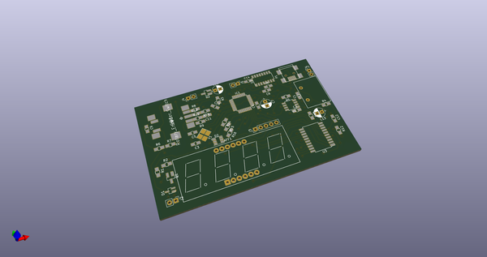
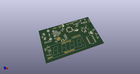
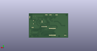
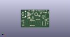

# OOMP Project  
## nespole  by coddingtonbear  
  
(snippet of original readme)  
  
- Microcontroller-controlled Laminator (Nespole)  
  
  
  
Need to control your laminator's temperature precisely because you use it  
for performing temperature-specific things like applying photosensitive  
dry film to PCBs or trying out the toner transfer method?  This lets you  
do that.  
  
-- Parts  
  
* [AmazonBasics Thermal Laminator](https://www.amazon.com/AmazonBasics-PL9-US-Thermal-Laminator/dp/B00BUI5QWS); ~$21 as of this writing.  
* 120VAC to 5VDC transformer; ~$5  
* [MAX6675 and K-Type thermocouple](https://www.amazon.com/HiLetgo-MAX6675-Thermocouple-Temperature-Arduino/dp/B01HT871SO/ref=sr_1_cc_3?s=aps&ie=UTF8&qid=1486343835&sr=1-3-catcorr&keywords=MAX6675);  
  ~$5 -- you'll need to remove the chip and mounting pins from the little PCB for attaching to the final board.  
* ATMega328pb microcontroller; ~$2 -- an ATMega328p would probably work just as well, but you may need to double-check the pinouts.  
* Common-cathode 4-digit 7-segment (+decimal point) Display; ~$1  
* AS1108WL common-cathode LED array controller or equivalent; ~$4  
* PEC11S Rotary encoder w/ button; ~$3  
* CH340G USB-Serial UART adapter; ~$1 -- not strictly necessary if you're comfortable programming the chip via the SPI bus  
* CLX6A 3.5mm x 3.5mm RGB LED; &lt;$1  
* A relay (for turning the heating element on/off)  
* A variety of passives, a diode, a logic-level p-channel mosfet, a logic-level n-channel mosfet (all SOT-23), etc; see the schematic  
  full source readme at [readme_src.md](readme_src.md)  
  
source repo at: [https://github.com/coddingtonbear/nespole](https://github.com/coddingtonbear/nespole)  
## Board  
  
  
## Schematic  
  
  
  
[schematic pdf](working_schematic.pdf)  
## Images  
  
  
  
  
  
  
