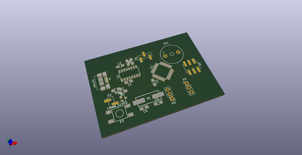
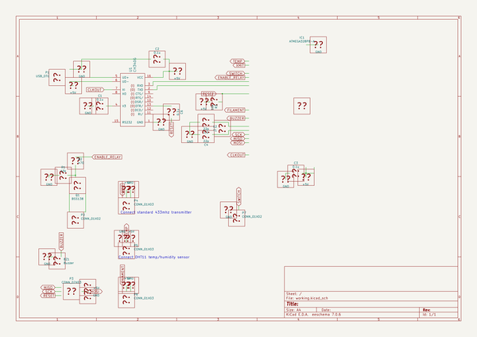
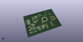
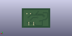
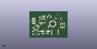

# OOMP Project  
## osminog  by coddingtonbear  
  
oomp key: oomp_projects_flat_coddingtonbear_osminog  
(snippet of original readme)  
  
- Octoprint-3D Printer Extras (Osminog)  
  
  
  
I have a 3D printer managed by Octoprint in my basement and would rather  
that I be able to turn on/off the fan and LED lighting supporting  
that printer programmatically via Octoprint's events API.  
  
What this provides is a USB device allowing me to:  
  
* Turn the power outlet supporting the LED lighting and 3D printer  
  off or on.  
* Switch DC power to a LED lighting strip.  
* Gather temperature and humidity measurements.  
* Watch whether I'm nearly out of filament using a [cheap filament sensor off of Ebay](https://www.ebay.com/i/371913487805?chn=ps&dispItem=1).  
* Beep when paused or when a print has completed.  This is useful for knowing when to change filament or when I need to insert a captive bolt or magnet.  
  
-- Commands  
  
* ``POWERON``: Turn on the RF-controlled outlet  
* ``POWEROFF``: Turn off the RF-controlled outlet  
* ``GETTEMPERATURE``: Return the current temperature (Celsius)  
* ``GETHUMIDITY``: Return the current humidity level  
* ``BUZZER``: Buzz the buzzer for half a second  
* ``FILAMENT``: Return a "1" or "0" depending upon whether filament is detected in the filament sensor.  
  
-- Schematic  
  
  
  
-- Errata  
  
* In the photo above of the final board, you'll see two bodges; those are there  
  to support programming the device via the USB port.  In the uploaded  
  sc  
  full source readme at [readme_src.md](readme_src.md)  
  
source repo at: [https://github.com/coddingtonbear/osminog](https://github.com/coddingtonbear/osminog)  
## Board  
  
  
## Schematic  
  
  
  
[schematic pdf](working_schematic.pdf)  
## Images  
  
  
  
  
  
  
