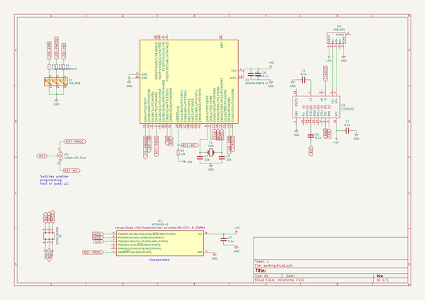

# OOMP Project  
## urchin  by coddingtonbear  
  
oomp key: oomp_projects_flat_coddingtonbear_urchin  
(snippet of original readme)  
  
- Urchin: Atmel Programmer with onboard 8-pin ATTiny pad  
  
  
  
Everybody makes their own programmer someday.  What this does in addition  
to all of the normal things you'd expect a programmer to do is include  
an 8-pin ATTiny pad allowing you to program an ATTiny on-the-fly by  
pressing it onto the unpopulated pad during programming.  
  
-- Schematic  
  
  
  
-- Fuse Settings  
  
We need slightly-nonstandard fuse settings so we can run both the microcontroller  
and the CH340 UART to USB adapter using the same 12MHz clock; these will differ  
from the default 12MHz settings in only the Low bit having CKOUT enabled.  
  
* Low: 0xbf  
* High: 0xde  
* Extended: 0xfd  
  
-- Enclosure  
  
You can also find a 3d-printable enclosure in the 'enclosure' folder. I  
recommend a clear filament (I used T-Glase) so you can see the glow  
of the LED.  
  
  full source readme at [readme_src.md](readme_src.md)  
  
source repo at: [https://github.com/coddingtonbear/urchin](https://github.com/coddingtonbear/urchin)  
## Board  
  
  
## Schematic  
  
  
  
[schematic pdf](working_schematic.pdf)  
## Images  
  
  
  
  
  
  
