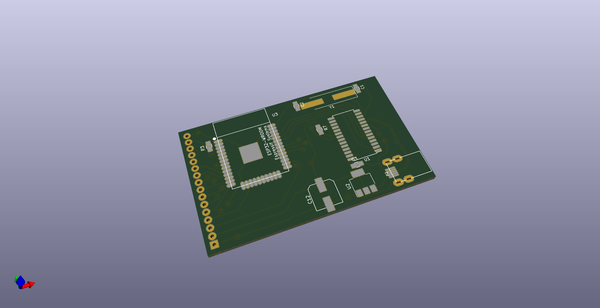
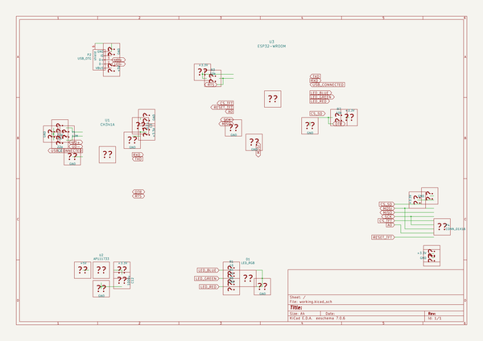
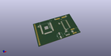
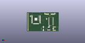

# OOMP Project  
## whiterose  by coddingtonbear  
  
(snippet of original readme)  
  
- Whiterose: A DIY Rescuetime + ESP32 Productivity Monitor IOT Device  
  
  
  
  
  
Whiterose is a DIY project you can use for building a (relatively) simple device for giving you an up-to-date assessment of how productive (or distracted) you are.  
  
-- Parts List (BOM)  
  
* 1x ESP32 ([~$4 on AliExpress](https://www.aliexpress.com/item/ESP-WROOM-32-ESP32-Bluetooth-and-WIFI-Dual-Core-CPU-with-Low-Power-Consumption-MCU/32793415575.html?spm=2114.search0104.3.26.5RzsyN&ws_ab_test=searchweb0_0,searchweb201602_4_10152_10065_10151_10130_10068_10344_10345_10547_10342_10546_10343_10340_10341_10548_10545_10541_10307_10060_10155_10154_10056_10055_10539_10537_10536_10059_10534_10533_100031_10103_10102_5670015_10142_10107_10324_5660015_10325_10562_10084_10083_10561_10178_10312_10313_10314_5650015_10550_10073_10551_10552_10553_10554_10557_10558-10552,searchweb201603_2,ppcSwitch_5&btsid=a117c8df-c8ed-4f43-8924-000555686ad1&algo_expid=a394fe7b-2047-489e-8816-9dba91acb8ad-3&algo_pvid=a394fe7b-2047-489e-8816-9dba91acb8ad))  
* 1x CH341A USB->UART ([~$1 on AliExpress](https://www.aliexpress.com/item/Free-shipping-CH341A-SOP28-USB-bus-switching-chip/32465435558.html?spm=2114.search0104.3.296.82WrhQ&ws_ab_test=searchweb0_0,searchweb201602_4_10152_10065_10151_10130_10068_10344_10345_10547_10342_10546_10343_10340_10341_10548_10545_10541_10307_10060_10155_10154_10056_10055_10539_10537_10  
  full source readme at [readme_src.md](readme_src.md)  
  
source repo at: [https://github.com/coddingtonbear/whiterose](https://github.com/coddingtonbear/whiterose)  
## Board  
  
  
## Schematic  
  
  
  
[schematic pdf](working_schematic.pdf)  
## Images  
  
  
  
  
  
  
