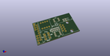
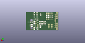
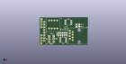

# OOMP Project  
## Really-Synced-485  by ContextualElectronics  
  
oomp key: oomp_projects_flat_contextualelectronics_really_synced_485  
(snippet of original readme)  
  
A small board breaking out serial to RS485  
  full source readme at [readme_src.md](readme_src.md)  
  
source repo at: [https://github.com/ContextualElectronics/Really-Synced-485](https://github.com/ContextualElectronics/Really-Synced-485)  
## Board  
  
  
## Schematic  
  
  
  
[schematic pdf](working_schematic.pdf)  
## Images  
  
  
  
  
  
  
