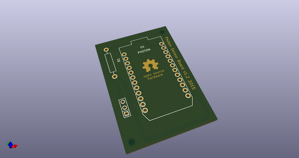
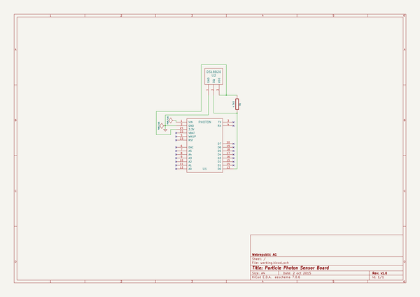
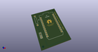
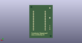
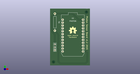

# OOMP Project  
## photon-sensor-board  by coredump-ch  
  
oomp key: oomp_projects_flat_coredump_ch_photon_sensor_board  
(snippet of original readme)  
  
- Photon Sensor Board  
  
A board to easily connect a Particle Photon with a DS18B20 temparature sensor.  
  
The ``particle-boards`` library can be found here:  
https://github.com/coredump-ch/kicad-particle  
  
**Order here:**  
  
- [DirtyPCBs](http://dirtypcbs.com/view.php?share=14221&accesskey=f6b3ffa6a66b2c59bf8eb13904b6e816)  
  
  
-- Screenshot  
  
  
  
  
-- PCB  
  
DirtyPCB production:  
  
  
  
Poorly self etched PCB:  
  
  
  
  
-- Assembly  
  
- Solder 2x12 pin headers to the photon pins.  
- Solder the resistor onto the board.  
- Solder a DS18B20 sensor to the board using a cable / wire. Make sure it's long  
  enough (<30cm) to prevent self-heating of the sensor.  
  On the screenshot of the PCB above, the bottom pin is GND (blue), the middle  
  one is Data (yellow) and the top pin is VDD (red). You can find the pin  
  numbering of the sensor [here](http://mikroshop.ch/?gruppe=6&artikel=30).  
  
  
-- Firmware  
  
https://github.com/coredump-ch/particle-ds18b20-firmware  
  
  
-- License  
  
MIT  
  
  full source readme at [readme_src.md](readme_src.md)  
  
source repo at: [https://github.com/coredump-ch/photon-sensor-board](https://github.com/coredump-ch/photon-sensor-board)  
## Board  
  
  
## Schematic  
  
  
  
[schematic pdf](working_schematic.pdf)  
## Images  
  
  
  
  
  
  
