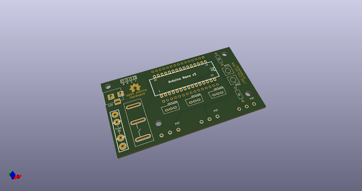
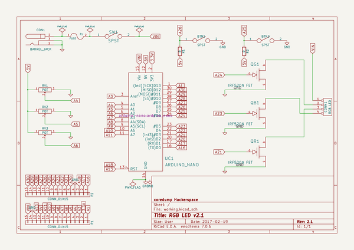
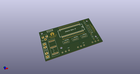
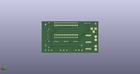
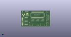

# OOMP Project  
## rgb-led  by coredump-ch  
  
oomp key: oomp_projects_flat_coredump_ch_rgb_led  
(snippet of original readme)  
  
- RGB LED  
  
An RGB LED board, originally developed in fall 2014 by coredump hackerspace in  
Rapperswil, Switzerland for teaching kids (~10y) the basics of electronics.  
  
-- Version 1  
  
The v1 consists of a potentiometer for each RGB color. The current is only  
controlled by the potentiometers. Therefore not too many LEDs can be driven at  
the same time.  
  
In contrast to v2 the v1 is also missing a switch to turn on/off the power.  
  
![foto v1][v1-photo-back]  
  
-- Version 2  
  
The v2 is more advanced and uses an Arduino Nano as controller. The arduino  
controls the RGB LEDs' brightness through PWM. The LEDs are switched with three  
MOSFETs. This enables the control of more LEDs at the same time.  
  
Project description is here: http://www.hackster.io/2460/arduino-controlled-rgb-led-strip  
  
![foto v2][v2-photo]  
![foto v2 pcb][v2-photo-pcb]  
![schema v2][v2-schema]  
  
-- Licensing  
  
See `LICENSE.md` file.  
  
  
[v1-photo-back]: https://raw.githubusercontent.com/coredump-ch/rgb-led/master/v1/photo_v1_back.jpg  
[v2-schema]: https://raw.githubusercontent.com/coredump-ch/rgb-led/master/v2/export/v2/schema.png  
[v2-photo]: https://raw.githubusercontent.com/coredump-ch/rgb-led/master/v2/photo_v2.jpg  
[v2-photo-pcb]: https://raw.githubusercontent.com/coredump-ch/rgb-led/master/v2/photo_v2_pcb.jpg  
  
  full source readme at [readme_src.md](readme_src.md)  
  
source repo at: [https://github.com/coredump-ch/rgb-led](https://github.com/coredump-ch/rgb-led)  
## Board  
  
  
## Schematic  
  
  
  
[schematic pdf](working_schematic.pdf)  
## Images  
  
  
  
  
  
  
