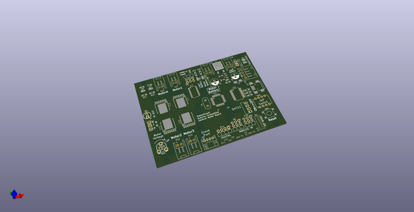
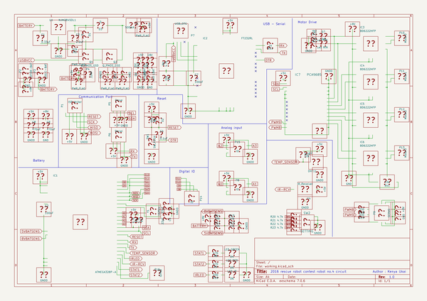
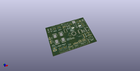
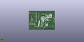
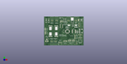

# OOMP Project  
## TPIP3SizeMotorBoard  by cormoran  
  
oomp key: oomp_projects_flat_cormoran_tpip3sizemotorboard  
(snippet of original readme)  
  
- TPIP3SizeMotorBoard  
ArduinoUnoCompatible Board for four wheel robot control (with TPIP3 image board)  
  
[Document](https://cormoran.github.io/TPIP3SizeMotorBoard/)  
  
  full source readme at [readme_src.md](readme_src.md)  
  
source repo at: [https://github.com/cormoran/TPIP3SizeMotorBoard](https://github.com/cormoran/TPIP3SizeMotorBoard)  
## Board  
  
  
## Schematic  
  
  
  
[schematic pdf](working_schematic.pdf)  
## Images  
  
  
  
  
  
  
