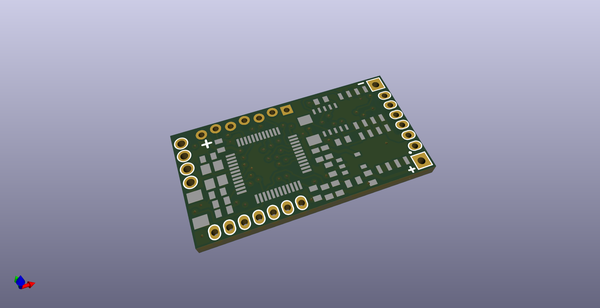
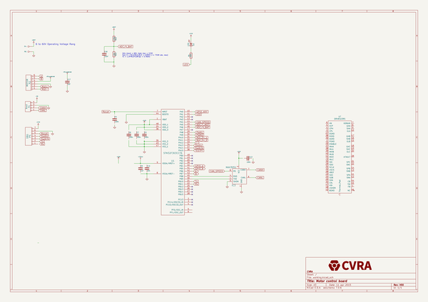
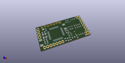
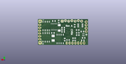
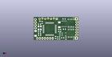

# OOMP Project  
## 3phase-board  by cvra  
  
oomp key: oomp_projects_flat_cvra_3phase_board  
(snippet of original readme)  
  
CVRA 3 Phases Controller  
========================  
  
Features:  
---------  
   
- 3 phases  ( BLDC, DC motor, Load )  
- 10A per phase  
- Operating voltage min 48V  
- CAN interface  
- Connection for Hall sensor  
- Connection for encoder with A/B/(I) interface (5V tolerant)  
- Current measurement  
- 1x LED  
- Bus connector -> PicoBlade  
  
  
  
License  
-------  
This project is released under the Creative Commons CC-BY-SA-4.0 license.  
See http://creativecommons.org/licenses/by-sa/4.0/ for details.  
  full source readme at [readme_src.md](readme_src.md)  
  
source repo at: [https://github.com/cvra/3phase-board](https://github.com/cvra/3phase-board)  
## Board  
  
  
## Schematic  
  
  
  
[schematic pdf](working_schematic.pdf)  
## Images  
  
  
  
  
  
  
