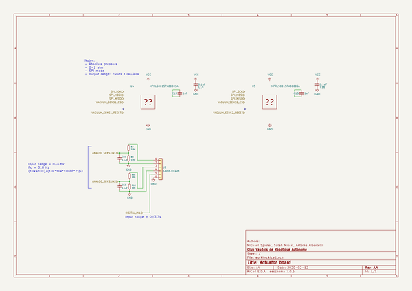

# OOMP Project  
## actuator-board  by cvra  
  
(snippet of original readme)  
  
-- CVRA Actuator Board  
  
__Features:__  
  
- STM32F302K8U6 (64K Flash, 16K RAM)  
- IOs  
    - 1 Digital input  
    - 2 Analog input  
    - 2 Servo PWM  
    - 2 motor outputs for vacuum pump  
- CAN interface with two 4pin Molex PicoBlade for daisy chaining  
- Debug connector (7pin Molex PicoBlade)  
    - SWD  
    - UART  
  
  
  
  
-- Generating Digikey BOM using Kicost  
  
Generate the Bom in XML format from KiCAD, then:  
  
```  
kicost -i actuator-board.xml --include digikey  
```  
  
  full source readme at [readme_src.md](readme_src.md)  
  
source repo at: [https://github.com/cvra/actuator-board](https://github.com/cvra/actuator-board)  
## Board  
  
[](working_3d.png)  
## Schematic  
  
[](working_schematic.png)  
  
[schematic pdf](working_schematic.pdf)  
## Images  
  
[](working_3d.png)  
  
[](working_3d_back.png)  
  
[](working_3d_front.png)  
