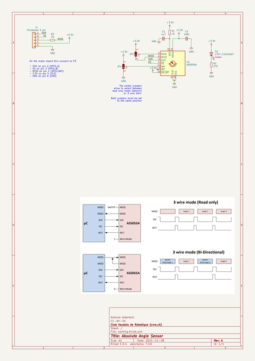

# OOMP Project  
## angle-sensor-board  by cvra  
  
(snippet of original readme)  
  
- Carte Codeur Absolu  
  
  
  
-- Cahier des charges  
  
--- Général  
  
* Le but de cette carte est de fournir une information de position angulaire absolue, c'est-à-dire un angle par rapport à une position de référence.  
* La carte se connecte à une carte moteur CVRA pour en augmenter les capacités.  
* La carte fournit 4096 points par tour.  
* La carte est assemblable à la main, mais peut nécessiter un pochoir pour les composants SMD.  
  
--- Electronique  
  
* Alimentation: 20mA @ 3.3V.  
* Connection compatible avec le connecteur de la carte moteur (P3 sur [ce schéma](https://github.com/cvra/motor-control-board/raw/revA/Moteur.pdf).  
* Interface SPI.  
* Branchement par un connecteur PicoBlade 5 pin.  
* LED pour indiquer l’alimentation.  
* Respecte les [design rules Aisler](https://aisler.net/help/design-rules-and-specifications/design-rules).  
* Taille des passifs: 0603.  
  
-- Mécanique  
  
* le plus petit possible (13mmx11mm)  
* 2x demi trous M2 sur bord opposée  
* connecteur sortie parallèle au PCB, sur face opposée au capteur  
* LED sur la même face que le connecteur  
* Capteur centré au milieux des vis  
  
  full source readme at [readme_src.md](readme_src.md)  
  
source repo at: [https://github.com/cvra/angle-sensor-board](https://github.com/cvra/angle-sensor-board)  
## Board  
  
  
## Schematic  
  
  
  
[schematic pdf](working_schematic.pdf)  
## Images  
  
  
  
  
  
  
