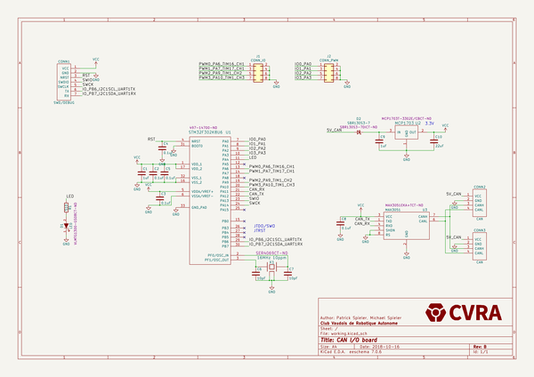
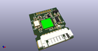
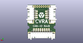
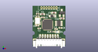

# OOMP Project  
## can-io-board  by cvra  
  
oomp key: oomp_projects_flat_cvra_can_io_board  
(snippet of original readme)  
  
-- CAN IO board  
  
__Features:__  
  
- STM32F302K8U6 (64K Flash, 16K RAM)  
- IOs _(not all funcitons can be used at the same time)_  
    - 4 Digital input  
    - 4 PWM output  
- CAN interface with two 4pin Molex PicoBlade for daisy chaining  
- Debug connector (7pin Molex PicoBlade)  
    - SWD  
    - UART  
  
__RevB change log:__  
  
- Replace soldering pads by connectors (2x 8 pin Molex PicoBlade)  
- Reduce number of exposed IO pin (4 digital input and 4 PWM output)  
- Protect against 5V voltage polarity inversion.  
  
  
  
  
  full source readme at [readme_src.md](readme_src.md)  
  
source repo at: [https://github.com/cvra/can-io-board](https://github.com/cvra/can-io-board)  
## Board  
  
  
## Schematic  
  
  
  
[schematic pdf](working_schematic.pdf)  
## Images  
  
  
  
  
  
  
