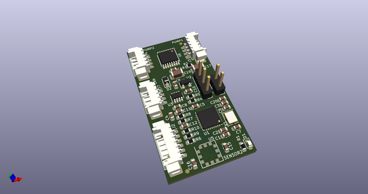
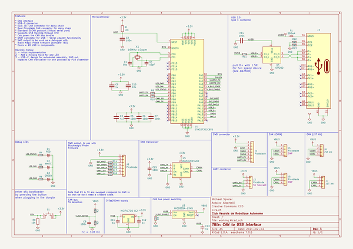
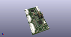
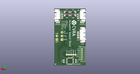
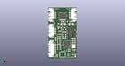

# OOMP Project  
## CAN-USB-dongle  by cvra  
  
oomp key: oomp_projects_flat_cvra_can_usb_dongle  
(snippet of original readme)  
  
- CAN to USB adapter dongle  
  
  
  
  
  full source readme at [readme_src.md](readme_src.md)  
  
source repo at: [https://github.com/cvra/CAN-USB-dongle](https://github.com/cvra/CAN-USB-dongle)  
## Board  
  
  
## Schematic  
  
  
  
[schematic pdf](working_schematic.pdf)  
## Images  
  
  
  
  
  
  
