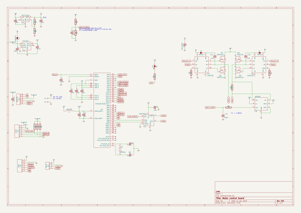

# OOMP Project  
## motor-control-board  by cvra  
  
oomp key: oomp_projects_flat_cvra_motor_control_board  
(snippet of original readme)  
  
CVRA DC-Motor Controller  
========================  
  
  
  
  
Features:  
---------  
  
 - CAN interface  
 - DC motor control with current sensing  
 - Quadrature encoder interface for motor (5V tolerant)  
 - Secondary quadrature encoder interface (5V tolerant) (eg. for separate odometry wheels)  
 - Analog input for RC-servo control  
 - Runs on 3 or 4 cell LiPo batteries  
  
License  
-------  
This project is released under the Creative Commons CC-BY-SA-4.0 license.  
See http://creativecommons.org/licenses/by-sa/4.0/ for details.  
  
  
Assembly  
--------  
  
- Applying solder paste  
  
 - This needs 2 persons.  
 - Solder paste and stencil need to be _cold_ (couple of minutes in the fridge)  
 - Use the 3D printed frames. Stick them to the table with double sided tape  
    and stick the PCB to the frame with small pieces of double sided tape.  
    If you don't do this, the PCB will stick to the sencil when you try to remove it.  
 - To remove the stencil, rotate it around one of the short edges, to pull it  
   as perpendicular as possible with the least amount of shaking.  
 - Move the PCB with the applied solder paste to a frame without double sided  
   tape before assembling the parts, because they would probably flick off.  
 - Check the footprints with the smallest pitch under the microscope for bad  
   alignment and if the brim is nice (if it isn't, the paste was probably too warm).  
  
  
- Assembling the parts  
 - Remove the solder paste on the NC pad of the voltage regulator with the wrong  
  full source readme at [readme_src.md](readme_src.md)  
  
source repo at: [https://github.com/cvra/motor-control-board](https://github.com/cvra/motor-control-board)  
## Board  
  
  
## Schematic  
  
  
  
[schematic pdf](working_schematic.pdf)  
## Images  
  
  
  
  
  
  
