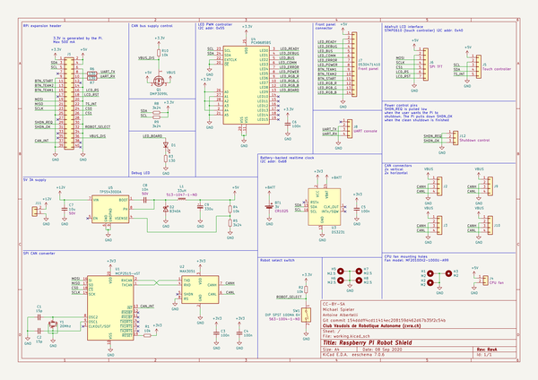

# OOMP Project  
## pi-shield  by cvra  
  
(snippet of original readme)  
  
- CVRA CAN Raspberry Pi Shield  
  
  
  
-- Features  
  
* Power supply from 12V to 36V to 5V, 3A.  
    Powers the Raspberry Pi, and optionally the CAN bus.  
* MCP2515 CAN interface (compatible with Linux/SocketCAN) with transceiver and two connectors for daisy chaining.  
* Connector for robot's front panel LEDs (dimmable) and pushbuttons.  
* Touchscreen connector (I2C for touch, SPI for pixel data)  
* DIP switch to discriminate between robots.  
* Battery-backed Realtime Clock allows the robot to keep the time even when powered off.  
* UART console  
* Power control pins, used to cleanly shutdown the Raspberry Pi before shutting power down.  
* Socket for a 20 mm DC fan.  
* Slot to allow the use of the PiCam camera module.  
  
  full source readme at [readme_src.md](readme_src.md)  
  
source repo at: [https://github.com/cvra/pi-shield](https://github.com/cvra/pi-shield)  
## Board  
  
  
## Schematic  
  
  
  
[schematic pdf](working_schematic.pdf)  
## Images  
  
  
  
  
