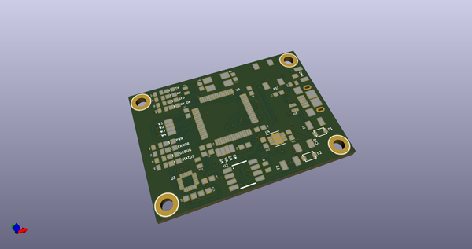
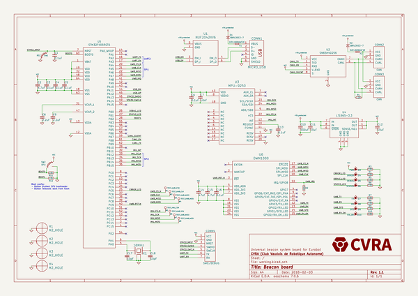
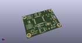
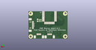
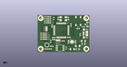

# OOMP Project  
## uwb-beacon-board  by cvra  
  
oomp key: oomp_projects_flat_cvra_uwb_beacon_board  
(snippet of original readme)  
  
- Universal beacon system board  
  
  
  
This repository holds the schematics and layout of a board used as beacon localisation system for Eurobot.  
It uses an Ultra-Wide Band module from Decawave and IMU.  
  
  full source readme at [readme_src.md](readme_src.md)  
  
source repo at: [https://github.com/cvra/uwb-beacon-board](https://github.com/cvra/uwb-beacon-board)  
## Board  
  
  
## Schematic  
  
  
  
[schematic pdf](working_schematic.pdf)  
## Images  
  
  
  
  
  
  
