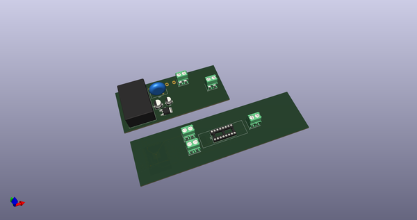
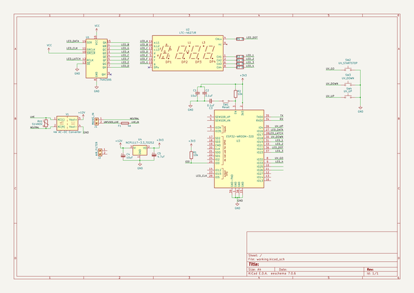
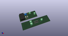
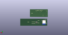
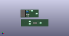

# OOMP Project  
## printer_cabinet  by Cylindric3D  
  
oomp key: oomp_projects_flat_cylindric3d_printer_cabinet  
(snippet of original readme)  
  
- PrinterCabinet  
  
- Key Components  
  
-- Hardware  
  
The electronic designs are all made using [KiCad](http://kicad-pcb.org).  
  
The actual KiCad project files are [here](Hardware/PrinterCabinet/).  
  
Rendered output (schematic and board PDFs, gerbers and bom) are [here](Hardware/Output/). (Not always up-to-date with the schematics and boards, so use with caution)  
  
  
  
--- License  
  
All hardware designs are licensed under the [CERN Open Hardware Licence v1.2](https://www.ohwr.org/licenses/cern-ohl/license_versions/v1.2).  
  
Myriam Ayass, legal adviser of the Knowledge and Technology Transfer Group at CERN and author of the CERN OHL:  
  
> In the spirit of knowledge sharing and dissemination, the CERN Open Hardware Licence (CERN OHL) governs the use, copying, modification and distribution of hardware design documentation, and the manufacture and distribution of products.  
>   
> The CERN–OHL is to hardware what the General Public Licence (GPL) is to software. It defines the conditions under which a licensee will be able to use or modify the licensed material. The concept of ‘open-source hardware’ or ‘open hardware’ is not yet as well known or widespread as the free software or open-source software concept. However, it shares the same principles: anyone should be able to see the source (the design documentation in case of hardware), study it, modify it and share it.  
>   
> In addition, if modifications are made and distributed, it mu  
  full source readme at [readme_src.md](readme_src.md)  
  
source repo at: [https://github.com/Cylindric3D/printer_cabinet](https://github.com/Cylindric3D/printer_cabinet)  
## Board  
  
  
## Schematic  
  
  
  
[schematic pdf](working_schematic.pdf)  
## Images  
  
  
  
  
  
  
