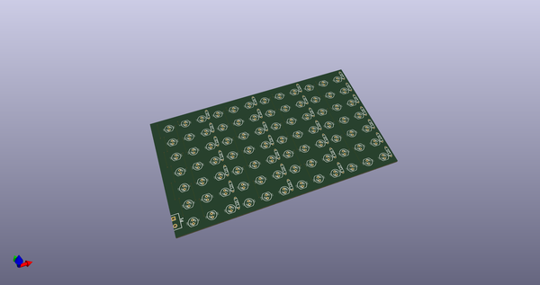
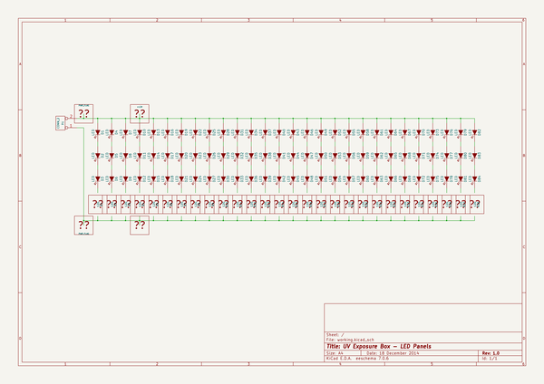
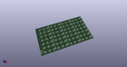
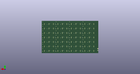
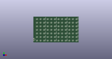

# OOMP Project  
## uv-box  by Cylindric3D  
  
(snippet of original readme)  
  
Note that documentation and schematics are also available as images in the [GitHub Pages](https://cylindric3d.github.io/uv-box/) site for this project.  
  
  
  
  
Important Plots  
===============  
* Controller Schematic  
* Controller Board: B.Cu  
* Controller Board: F.SilkS  
* LED Panels Schematic  
* LED Panels Board: B.Cu  
  
Tips for Creating the PCB  
=========================  
For creating the PCBs with UV-sensitive boards:  
  
1. Text on the B.Cu layer should appear mirrored  
2. Plot only the bottom copper "B.Cu" layer to PDF, do not mirror it - it should look mirrored in the PDF.  
   This is because you want the ink to be as close to the photo-sensitive surface of the PCB as possible.  
3. Print the B_Cu.pdf onto transparencies suitable for your printer.  
  full source readme at [readme_src.md](readme_src.md)  
  
source repo at: [https://github.com/Cylindric3D/uv-box](https://github.com/Cylindric3D/uv-box)  
## Board  
  
  
## Schematic  
  
  
  
[schematic pdf](working_schematic.pdf)  
## Images  
  
  
  
  
  
  
