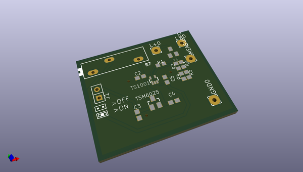

# OOMP Project  
## Micro_Constant_Current  by DangerousPrototypes  
  
oomp key: oomp_projects_flat_dangerousprototypes_micro_constant_current  
(snippet of original readme)  
  
  
  full source readme at [readme_src.md](readme_src.md)  
  
source repo at: [https://github.com/DangerousPrototypes/Micro_Constant_Current](https://github.com/DangerousPrototypes/Micro_Constant_Current)  
## Board  
  
  
## Schematic  
  
  
  
[schematic pdf](working_schematic.pdf)  
## Images  
