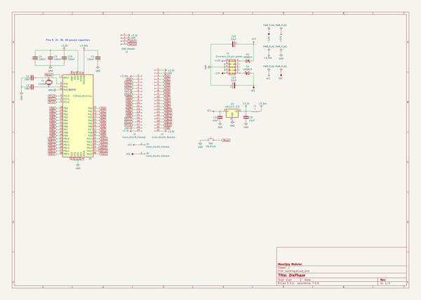

# OOMP Project  
## Addatone  by dchwebb  
  
oomp key: oomp_projects_flat_dchwebb_addatone  
(snippet of original readme)  
  
- Addatone  
  
  
Overview  
--------  
  
Addatone is a Eurorack oscillator using additive synthesis. It is a two channel oscillator with channel one outputting fundamental and odd harmonics and channel two fundamental and even harmonics.  
  
Each channel has potentiometer and CV control over the number of harmonics with higher harmonics progressively attenuated. In addition a 'Count' pot and CV input hard-limit the total number of audible harmonics. A warp control progressively detunes the odd harmonics up and even harmonics down.  
  
Channel one has a mix switch which allows a mix of both channels to be output from channel one. Channel two has a multiply switch which allows a multiple of both channels to be output from channel two (ie a ring modulation effect).  
  
The final controls are an octave potentiometer covering a five octave range and a fine tune control covering around an octave.  
  
Architecture  
------------  
  
  
  
The core sound generator is an ICE40UP5K FPGA from Lattice. This is responsible for generating the harmonics, mixing/multiplying and then outputting to the DAC via I2S protocol.  
  
The module also contains an STM32F446 microcontroller which holds the FPGA bitstream in internal flash memory; this is used to program the FPGA on start-up via SPI. In addition the STM32 is used as an ADC to digitise and sca  
  full source readme at [readme_src.md](readme_src.md)  
  
source repo at: [https://github.com/dchwebb/Addatone](https://github.com/dchwebb/Addatone)  
## Board  
  
  
## Schematic  
  
  
  
[schematic pdf](working_schematic.pdf)  
## Images  
  
  
  
  
  
  
