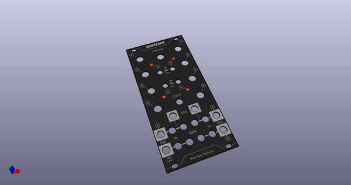

# OOMP Project  
## Ampelope  by dchwebb  
  
oomp key: oomp_projects_flat_dchwebb_ampelope  
(snippet of original readme)  
  
- Ampelope  
  
  
Overview  
--------  
  
Ampelope is a four-channel combined envelope and VCA Eurorack module incorporating a tremolo effect. Each channel can be switched between a fast envelope time, a slow envelope time or a slow envelope with a sine tremolo modulating volume.  
  
The envelopes are loosely modelled on an analog envelope (Roland System 100 type circuit) and feature analog correct capacitor charge/discharge characteristics.  
  
Channels 1 and 2 share the same Attack/Decay/Sustain/Release (ADSR) controls, as do channels 3 and 4. This makes the module particularly suited to dual stereo operation. However each channel has its own gate control allowing independent control of four signals.  
  
The gate controls are normalled in a cascade configuration. For example in dual stereo use gate 1 will be normalled to gate 2 and then a separate gate applied to channel 3 will control channels 3 and 4. In addition gate 1 is normalled to the Doepfer standard gate signal on the 16 pin Eurorack header.  
  
The tremolo control can be clocked or free-run. When clocked the Tremolo potentiometer sets the speed of the tremolo to a multiple of the clock. The tremolo effect applies a sine wave modulation to the envelope.  
  
In addition to the envlopes internal connection to the VCA, envelopes 1 and 3 are available on the front panel and envelopes 2 and 4 on a pin header on the back.  
  
Technical  
---------  
  
  
source repo at: [https://github.com/dchwebb/Ampelope](https://github.com/dchwebb/Ampelope)  
## Board  
  
  
## Schematic  
  
  
  
[schematic pdf](working_schematic.pdf)  
## Images  
  
  
  
  
  
  
  
  
  
  
  
  
  
  
  
  
  
  
  
  
  
  
