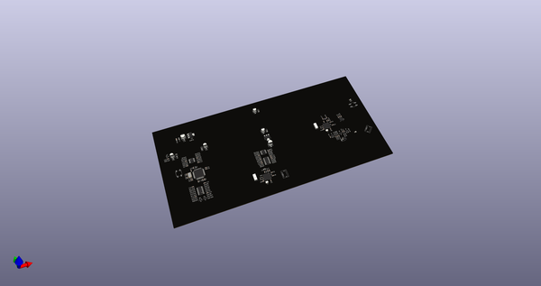
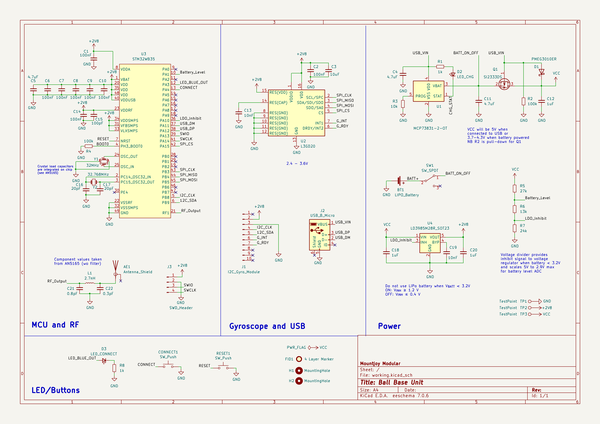
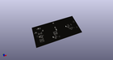
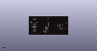
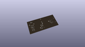
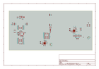
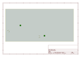
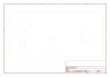
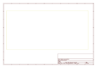
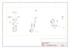

# OOMP Project  
## Ball  by dchwebb  
  
(snippet of original readme)  
  
- Ball  
  
  
Overview  
--------  
  
Ball is a Bluetooth remote controller for a Eurorack modular synthesiser. The remote controller is a sphere containing a PCB with an STM32WB35 BLE transmitter connected to an STM MEMS gyroscope. The remote communicates over Bluetooth Low Energy (BLE) with a base unit. The base unit is a standard Eurorack module that converts the three axis gyroscope information into three control voltages.  
  
Project Status  
--------------  
  
Project is currently on hold following partially successful first prototype stage. Parts shortages of both microcontrollers and MEMS units are making further prototypes impossible to build. BLE functionality is partly working but connections are proving extremely unreliable probably as a result of incorrectly matched antennas. Proper RF matching would require significant expenditure in RF test equipment (VNA etc) making progress on the project impractical at this time.  
  
Technical  
---------  
  
  
Both the base unit and remote were initially developed on the STM32WB55 nucleo and dongle hardware. Lack of availability of the WB55 has required the use of STM32WB35 MCU in the initial prototypes.  
  
Remote  
------  
  
The remote unit is designed to be powered from a Li-Po battery which is charged via a USB micro connection. Battery charging uses a MCP73831 Microchip C  
  full source readme at [readme_src.md](readme_src.md)  
  
source repo at: [https://github.com/dchwebb/Ball](https://github.com/dchwebb/Ball)  
## Board  
  
  
## Schematic  
  
  
  
[schematic pdf](working_schematic.pdf)  
## Images  
  
  
  
  
  
  
  
  
  
  
  
  
  
  
  
  
  
  
  
  
  
  
