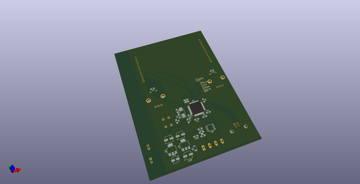
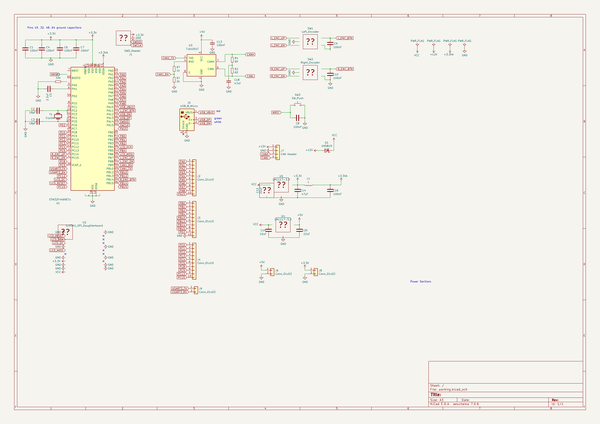
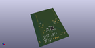
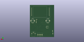
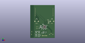

# OOMP Project  
## CAN_Sniffer  by dchwebb  
  
oomp key: oomp_projects_flat_dchwebb_can_sniffer  
(snippet of original readme)  
  
- CAN_Sniffer  
  
CAN Bus sniffer developed for STM32F429 platform using the STM32F429 Discovery board. This connects to a car's dashboard CAN bus via a NXP TJA1050 transceiver over the OBD2 protocol.  
  
The OBD2 protocol is an industry-wide standard to provide access to a vehicle's self-diagnostic data via the CAN bus. The CAN Sniffer provides a GUI displaying real-time statistics decoded from the OBD2 protocol.  
  
CAN Sniffer has been tested with a Ford Mondeo and Audi A3.  
  
  full source readme at [readme_src.md](readme_src.md)  
  
source repo at: [https://github.com/dchwebb/CAN_Sniffer](https://github.com/dchwebb/CAN_Sniffer)  
## Board  
  
  
## Schematic  
  
  
  
[schematic pdf](working_schematic.pdf)  
## Images  
  
  
  
  
  
  
