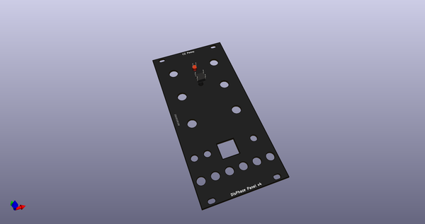
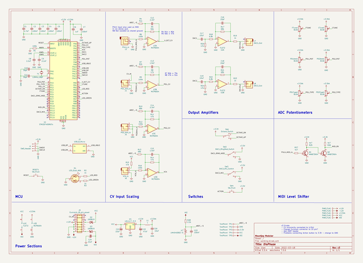
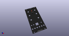
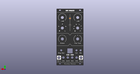
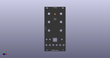

# OOMP Project  
## DisPhaze  by dchwebb  
  
(snippet of original readme)  
  
- Dis Phaze  
  
  
  
Eurorack module providing two Phase Distortion oscillators based on Casio's CZ synthesizors.   
  
Phase distortion involves warping a sine wave using a second phase distortion signal. The phase distortion tables in this module were loosely based on waveforms sampled from a Casio CZ-1000. Both oscillators allow the sine wave to be warped by a greater amount than on the original and in the case of oscillator 1 the phase distortion tables can be continuously varied.  
  
Functionality  
-------------  
  
Disphaze is a two channel design where each channel controls 5 phase distortion waves. These are used to change the playback rate of the audio wave which is always a sine wave. All of the PD waves are based on the CZ but some are generated mathematically, some literally sampled and converted from an original CZ-1000.  
  
The module is duophonic – channel one has a bit more range and so can go more extreme than the CZ. Channel one allows the PD waves morph from one to the next. The second channel does not morph and has a more limited range so it is a bit more 'authentic'. Channel two can also be offset by an octave from channel one which is particularly useful for ring modulation. The module works well in stereo with the two channels split left and right.  
  
Channel one has a Ring Mod switch which digita  
  full source readme at [readme_src.md](readme_src.md)  
  
source repo at: [https://github.com/dchwebb/DisPhaze](https://github.com/dchwebb/DisPhaze)  
## Board  
  
  
## Schematic  
  
  
  
[schematic pdf](working_schematic.pdf)  
## Images  
  
  
  
  
  
  
