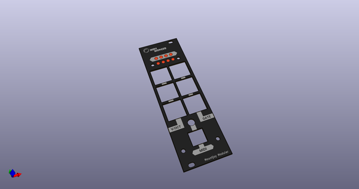

# OOMP Project  
## MidiMonger  by dchwebb  
  
(snippet of original readme)  
  
- MidiMonger  
  
  
Eurorack MIDI interface supporting USB and serial MIDI.   
  
MIDI Monger is a configurable MIDI interface for controlling Eurorack modules from either USB MIDI or Serial MIDI (or both simultaneously).  
  
MIDI Monger has 12 outputs of which 8 are gate outputs and 4 are control voltage outputs. The first eight outputs are configured by default as channel pairs. When assigned a MIDI channel they will act as a monophonic gate/cv driven from a single MIDI channel or in polyphonic mode supporting up to 4 note polyphony.  
  
When not used in a pair a gate output can send a gate for any MIDI on note from a channel, for a specific note number on a channel (eg for use as drum triggers) or a clock. The Control Voltage outputs can be configured to send controller data, pitch bend or aftertouch.  
  
Configuration is carried out from a [web interface](https://htmlpreview.github.io/?https://github.com/dchwebb/MidiMonger/blob/master/WebEditor/index.html) using the Chrome browser or via a Virtual COM Port.  
  
- Technical  
  
MIDI Monger is based around an ARM STM32F446 Microcontroller. The MCU handles both MIDI and UART Serial interfacing and outputs control voltage via an external 16 bit DAC (Maxim MAX5134). Gate outputs are converted to Eurorack standard of 5V using a SN74HCT244 Octal buffer as a lev  
  full source readme at [readme_src.md](readme_src.md)  
  
source repo at: [https://github.com/dchwebb/MidiMonger](https://github.com/dchwebb/MidiMonger)  
## Board  
  
  
## Schematic  
  
  
  
[schematic pdf](working_schematic.pdf)  
## Images  
  
  
  
  
  
  
  
  
  
  
  
  
  
  
  
  
  
  
  
  
  
  
