# OOMP Project  
## Oscar  by dchwebb  
  
oomp key: oomp_projects_flat_dchwebb_oscar  
(snippet of original readme)  
  
- Oscar  
  
  
Overview  
--------  
  
Oscar is a three channel oscilloscope, spectrum analyser and MIDI event viewer designed for use in a Eurorack modular synthesiser. Each of the three channels has a buffered through allowing use any where in the signal chain.  
  
The oscilloscope can display up to three channels at once, either in separate lanes or overlaid. Horizontal and vertical zoom are available and a trigger with adjustable x/y can be applied to any channel.  
  
  
  
The spectrum analyser is used to show the frequency components of any signal. The frequencies of the principal harmonics are shown both graphically and numerically. An autotune function dynamically adjusts the sample rate to lock on the fundamental frequency of the signal. This gives an extremely clear view of the frequency spectrum whilst being fast enough for real-time use.  
  
  
  
A waterfall plot shows the frequency spectrum over time in a 3 dimensional view.  
  
  
  
A MIDI event viewer displays the MIDI channel, note on/off status, pitchbends, control changes and aftertouch. Clock speed is indicated with a flashing dot.   
  
  
  
source repo at: [https://github.com/dchwebb/Oscar](https://github.com/dchwebb/Oscar)  
## Board  
  
[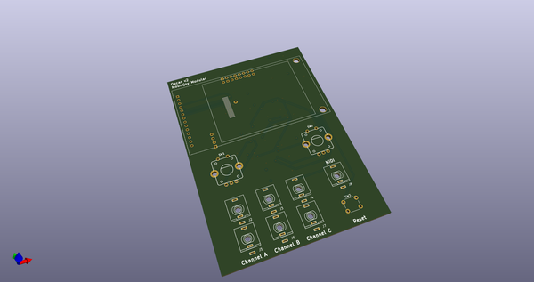](working_3d.png)  
## Schematic  
  
[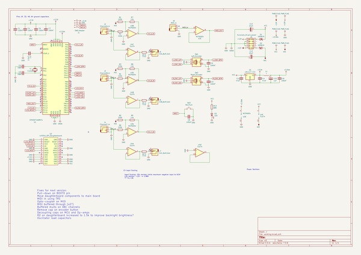](working_schematic.png)  
  
[schematic pdf](working_schematic.pdf)  
## Images  
  
[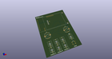](working_3d.png)  
  
[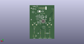](working_3d_back.png)  
  
[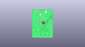](working_3D_bottom.png)  
  
[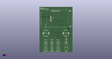](working_3d_front.png)  
  
[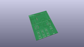](working_3D_top.png)  
  
[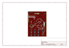](working_assembly_page_01.png)  
  
[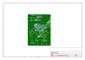](working_assembly_page_02.png)  
  
[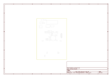](working_assembly_page_03.png)  
  
[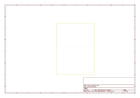](working_assembly_page_04.png)  
  
[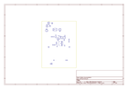](working_assembly_page_05.png)  
  
[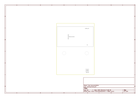](working_assembly_page_06.png)  
