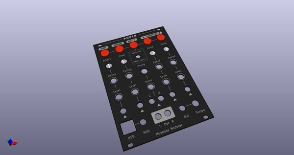
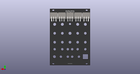
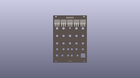
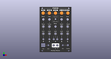
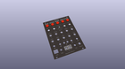
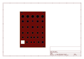
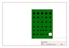
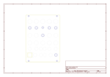
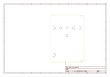
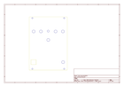

# OOMP Project  
## Punck  by dchwebb  
  
(snippet of original readme)  
  
- Punck  
  
  
Overview  
--------  
  
- Audio Demo with Kick, snare and hi hats: [Punck.wav](https://raw.githubusercontent.com/dchwebb/Punck/master/Drum_Sequences/Punck.wav)  
- Audio Demo with all voices and samples: [Punck2.wav](https://raw.githubusercontent.com/dchwebb/Punck/master/Drum_Sequences/Punck2.wav)  
  
Punck is drum machine designed for use with Eurorack modular synthesizers. Its five primary voices are Kick, Snare, High Hat and two sample playback channels. In addition Toms and Claps voices are available via MIDI.  
  
It features a built-in drum sequencer with five patterns each with up to 4 bars in length and either 16 or 24 beats per bar.  
  
Voices can be triggered via front panel illuminated buttons, gate input, USB MIDI, serial MIDI and the drum sequencer. All trigger modes are available simultaneously.  
  
Samples are stored on 32MB of internal Flash memory. This storage space is made available as a standard USB drive, requiring no external drives or SD cards.  
  
A browser-based editor allows drum sequences to be entered graphically and detailed parameters of internal voices to be edited. A MIDI mapping facility provides access to different articulations of voices and different samples for the sampler tracks.  
  
  
Audio DSP  
---------  
  
--- Kick  
The kick drum is modelled on a Roland TR-808 kick. This is generated in five phases, the first three providing an initial steep ramp and discontinui  
  full source readme at [readme_src.md](readme_src.md)  
  
source repo at: [https://github.com/dchwebb/Punck](https://github.com/dchwebb/Punck)  
## Board  
  
  
## Schematic  
  
  
  
[schematic pdf](working_schematic.pdf)  
## Images  
  
  
  
  
  
  
  
  
  
  
  
  
  
  
  
  
  
  
  
  
  
  
