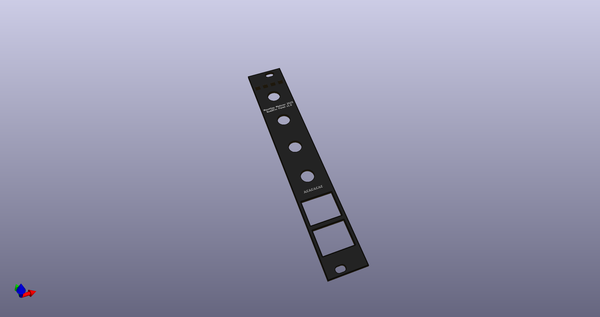
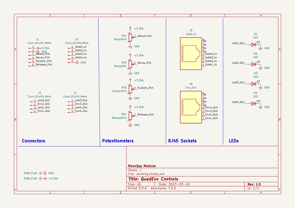
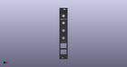
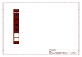
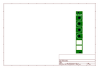
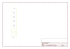
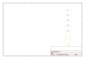

# OOMP Project  
## QuadEnv  by dchwebb  
  
(snippet of original readme)  
  
- QuadEnv  
  
  
QuadEnv  
--------  
  
QuadEnv is a four-voice polyphonic ADSR envelope generator designed for use with the Eurorack Modular Synthesiser architecture.  
  
As part of a range of compatilble Mountjoy Modular modules, polyphonic interconnections are made using RJ-45 cables (as used for Ethernet).  
  
The digital envelopes are modelled on a Roland System 100 system, with logarithmic/exponential attack/decay and release sections. The level of each envelope is displayed in a bank of LEDs at the top of the module.  
  
A USB serial console allows the envelope times to be scaled up or down for longer or shorter envelopes.  
  
Technical  
---------  
  
  
  
The module is based around an STM32G431 microcontroller which contains four internal 12 bit DACs used to generate the envelopes at approximately 47kHz.  
  
A CD40109B level shifter provides input protection for the Gate In signals. A TL074 op-amp ampilifies the DAC outputs to around 8 volts at maximum.  
  
Construction is a sandwich of three PCBs with a component board, a controls board and a panel. PCBs designed in Kicad v6.  
  
[Components schematic](https://raw.githubusercontent.com/dchwebb/QuadEnv/master/Component_Schematic.pdf)  
  
[Controls schematic](https://raw.githubusercontent.com/dchwebb/QuadEnv/master/Control_Schematic.pdf)  
  
--- Power  
  
The Eurorack +  
  full source readme at [readme_src.md](readme_src.md)  
  
source repo at: [https://github.com/dchwebb/QuadEnv](https://github.com/dchwebb/QuadEnv)  
## Board  
  
  
## Schematic  
  
  
  
[schematic pdf](working_schematic.pdf)  
## Images  
  
  
  
  
  
  
  
  
  
  
  
  
  
  
  
  
  
  
  
  
  
  
