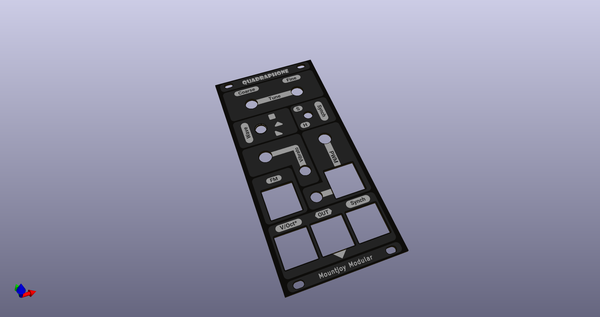
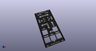
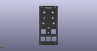
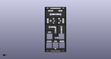
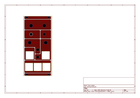
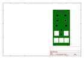
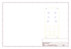
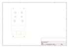
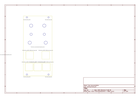

# OOMP Project  
## Quadraphone  by dchwebb  
  
oomp key: oomp_projects_flat_dchwebb_quadraphone  
(snippet of original readme)  
  
- Quadraphone  
  
  
Quadraphone  
--------  
  
Quadraphone is a four voice polyphonic analog Voltage Controlled Oscillator for use within a Eurorack Modular Synthesiser. Polyphonic signal interconnections are made via RJ-45 cables (ie Ethernet cables).  
  
Quadraphone features a switchable output of square, triangle and saw waves. Pulse Width Modulation (PWM) is available for the square wave, polyphonically via an RJ-45 input or across all voices via a 3.5mm jack. A potentiometer sets the default pulse width across all voices.  
  
Polyphonic synch is available and a switch allows selection of hard, soft or off settings. Exponentional FM is available on an Rj-45 connection and vibrato (linear FM) is available via a 3.5mm jack with potentiometer attenuation.  
  
A volt per octave input is available on an RJ-45 connector. Pins 1-4 carry the control voltage input and pins 5-8 carry the output signal (also available on an RJ-45) for easy module interconnection. Coarse and Fine tune potentiometers affect all voices.  
  
Technical  
---------  
  
Each Quadraphone voice is based around the [Sound Semiconductor SSI2131 Fatkeys VCO](https://www.soundsemiconductor.com/).  
  
Each VCO outputs three voices (pulse, triangle and saw) which are switched via Nexperia 74LV4066PW analog switches. 74LV4066PW ICs are also used to switch incoming synch signals between the hard, soft and off selections.  
  
Each voice has trimmer  
  full source readme at [readme_src.md](readme_src.md)  
  
source repo at: [https://github.com/dchwebb/Quadraphone](https://github.com/dchwebb/Quadraphone)  
## Board  
  
  
## Schematic  
  
  
  
[schematic pdf](working_schematic.pdf)  
## Images  
  
  
  
  
  
  
  
  
  
  
  
  
  
  
  
  
  
  
  
  
  
  
