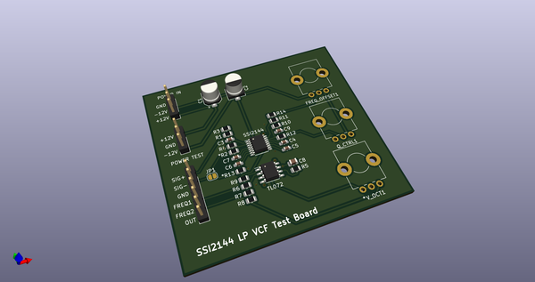
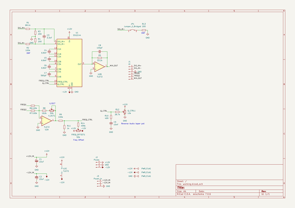
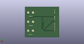
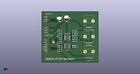
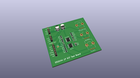

# OOMP Project  
## Quilter  by dchwebb  
  
oomp key: oomp_projects_flat_dchwebb_quilter  
(snippet of original readme)  
  
- Quilter  
  
  
Quilter  
--------  
  
Quilter is a four-voice polyphonic analog low pass filter designed for use with the Eurorack Modular Synthesiser architecture.  
  
As part of a range of compatilble Mountjoy Modular modules, polyphonic interconnections are made using RJ-45 cables (as used for Ethernet).  
  
Each of the four filters is a four-pole self-oscillating low pass filter. Cutoff is controlled by a combination of shared signals (frequency potentiometer and jack socket) and two individual  controls frequency controls (one at approximately half the sensitivity of the other) available on RJ-45 connectors.  
  
Resonance is controlled from a potentiometer with self-oscillation available at extreme settings.  
  
Polyphonic output is available from an RJ-45 socket and a mixed output is available on a 3.5mm jack socket.  
  
The module is built around the Sound Semiconductor SSI2144 Fatkeys Four-Pole Voltage Controlled Filter. A number of TL074/TL072 op-amps are used for control signal mixing, buffering and output amplification.  
  
Two trimmer potentiometers are available for each voice to control volt per octave when using the filter in self-resonant mode, and frequency offset to control the base frequency of the cut-off of each voice.  
  
Technical  
---------  
  
  
  
Construction is a sandwich of three PCBs wi  
  full source readme at [readme_src.md](readme_src.md)  
  
source repo at: [https://github.com/dchwebb/Quilter](https://github.com/dchwebb/Quilter)  
## Board  
  
  
## Schematic  
  
  
  
[schematic pdf](working_schematic.pdf)  
## Images  
  
  
  
  
  
  
  
  
  
  
