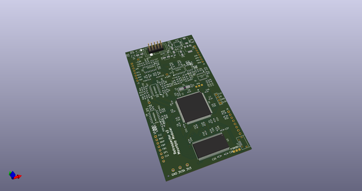
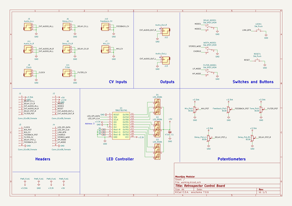

# OOMP Project  
## Retrospector  by dchwebb  
  
oomp key: oomp_projects_flat_dchwebb_retrospector  
(snippet of original readme)  
  
- Retrospector  
  
  
Retrospector is a Eurorack format stereo digital delay.   
  
Delay times can be set clocked or free-running and left and right channels can be independent or the right channel set as a multiple of the left channel. The delay times are switchable between short, long and reversed with maximum delay times over 5 minutes.  
  
The feedback path can be filtered with settings allowing a sweep from low pass to high pass, or either separately. The delayed signal can be modulated for subtle chorussing effects or left and right channels fed back into each other to widen dual mono sources.  
  
The feedback control allows greater than 100% regeneration allowing the delay to increase the volume of the delayed signal.  
  
Three RGB LEDs display the delay times (using different colours to indicate clocking and channel linking) and the filter status (white to red with increasing low pass filtering and white to blue for high pass).  
  
A USB port is available on the rear of the module providing configuration, debug and upgrade options via a serial interface.  
  
- Technical  
The module is constructed from a sandwich of three PCBs. The front panel is held to the control PCB using the potentiometers and jack sockets with light guides directing the RGB LEDs from the control PCB. The control PCB also houses the LED driver. All other components are on the component PCB and this is attached to the control PCB   
  full source readme at [readme_src.md](readme_src.md)  
  
source repo at: [https://github.com/dchwebb/Retrospector](https://github.com/dchwebb/Retrospector)  
## Board  
  
  
## Schematic  
  
  
  
[schematic pdf](working_schematic.pdf)  
## Images  
  
  
  
  
  
  
  
  
  
  
  
  
  
  
  
  
  
  
  
  
  
  
