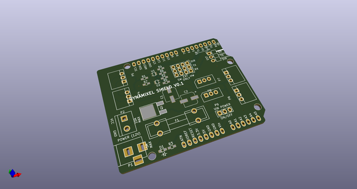
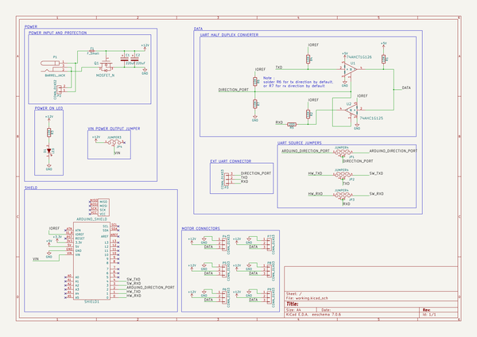
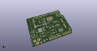
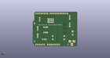
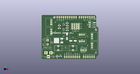

# OOMP Project  
## DynamixelShield  by descampsa  
  
oomp key: oomp_projects_flat_descampsa_dynamixelshield  
(snippet of original readme)  
  
- Dynamixel shield  
  
  
  
  
-- What is it?  
  
This is an arduino shield to control dynamixel servo motors from Robotis. AX and MX series (TTL version) are supported. Thanks to their half-duplex serial control protocol, you can chain them and control a lot of motor simultaneously (up to 254 in theory). It is possible to control those motors with an arduino without additionnal hardware, but this board makes it easier and cleaner.  
  
-- How to use it?  
  
--- Hello world (aka blink my led)  
  
First install the [ardyno](https://github.com/descampsa/ardyno/) library, using the Arduino Library Manager, or directly from the github repository.  
Then open the "test_led" example and upload it. The shield can not be installed when you install the program.  
Install the shield, check that the jumpers are on 'HW' position, connect the motor and a 12v power supply, and voila, the motor "led" should start blinking!  
To get the motor moving (that's the point, after all), check the "test_motor" exemple. The documentation is still lacking, but by browsing examples and code, you should be able to do understand how it works. If you have any question, just ask.  
  
--- Software serial  
  
The default mode explained above is to use the first hardware UART (Serial) of the board to communicate with the motors. This has the advantage that you can usethe full communication speed (up to 2Mbaud, by default 1Mbaud) of the protocol. However, boards that only h  
  full source readme at [readme_src.md](readme_src.md)  
  
source repo at: [https://github.com/descampsa/DynamixelShield](https://github.com/descampsa/DynamixelShield)  
## Board  
  
  
## Schematic  
  
  
  
[schematic pdf](working_schematic.pdf)  
## Images  
  
  
  
  
  
  
