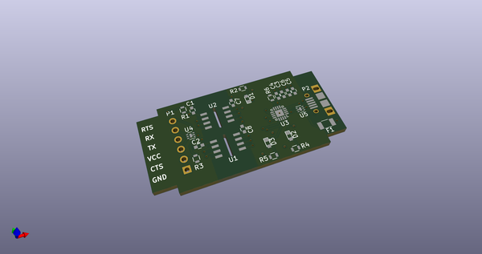
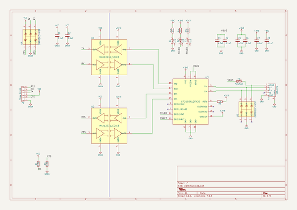
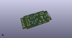
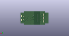
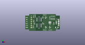

# OOMP Project  
## usb_uart  by descampsa  
  
(snippet of original readme)  
  
Isolated uart-usb converter.  
  
Features:  
- Silab CP2102N converter  
- MAX12931 isolators  
- Up to 3Mbaud UART, with hardware flow control (RTS/CTS)  
- Supports 5V, 3.3V and 1.8V VCC  
- Maximum withstand isolation voltage (VISO) : 3KV RMS  
- Maximum working isolation voltage (VIOWM) : 445V RMS  
- ABS plastic enclosure, with micro usb connector, and 0.1'' 6 pins header for uart  
  
  full source readme at [readme_src.md](readme_src.md)  
  
source repo at: [https://github.com/descampsa/usb_uart](https://github.com/descampsa/usb_uart)  
## Board  
  
  
## Schematic  
  
  
  
[schematic pdf](working_schematic.pdf)  
## Images  
  
  
  
  
  
  
