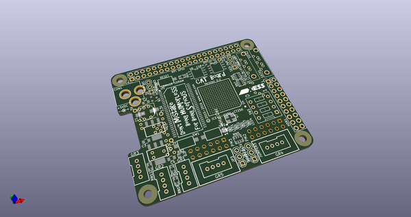
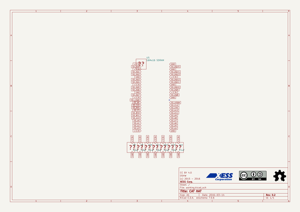
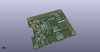
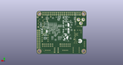

# OOMP Project  
## CAT-Board  by devbisme  
  
oomp key: oomp_projects_flat_devbisme_cat_board  
(snippet of original readme)  
  
- CAT  
  
  
- Description  
  
The CAT Board is a Raspberry Pi HAT with a Lattice iCE40HX FPGA.  
  
* License: [CC BY 4.0](http://creativecommons.org/licenses/by/4.0/legalcode)  
* Documentation: [CAT-Board.readthedocs.org](https://CAT-Board.readthedocs.org)  
  
  
- Features  
  
* Lattice iCE40-HX8K FPGA in 256-pin BGA.  
* 32 MByte SDRAM (16M x 16).  
* Serial configuration flash (at least 2 Mbit).  
* Three Grove connectors.  
* Two PMOD connectors.  
* One 20x2 header with 3.3V, ground and 18 FPGA I/Os.  
* Two SATA headers (for differential signals; don't know if they would work with SATA HDDs.)  
* DIP switch with four SPST switches.  
* Two momentary pushbuttons.  
* Four LEDs.  
* 100 MHz oscillator.  
* 5.0 V jack for external power supply.  
* 3.3 V and 1.2 V regulators.  
* Adjustable voltage on one bank of FPGA I/O pins.  
* 32 KByte HAT EEPROM.  
* 40-pin RPi GPIO header.  
  
  
[ CAT Schematic ](https://raw.githubusercontent.com/xesscorp/CAT-Board/master/docs/Manual/pics/CAT_schematic.pdf)  
  
  
  
  
  
  
  full source readme at [readme_src.md](readme_src.md)  
  
source repo at: [https://github.com/devbisme/CAT-Board](https://github.com/devbisme/CAT-Board)  
## Board  
  
  
## Schematic  
  
  
  
[schematic pdf](working_schematic.pdf)  
## Images  
  
  
  
  
  
  
