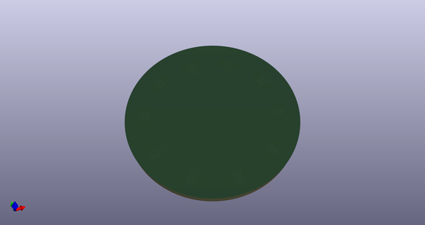
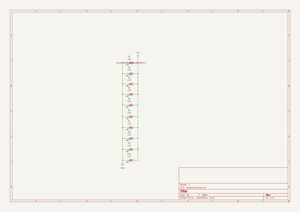
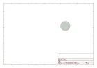
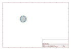
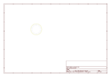
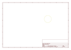
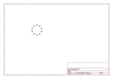
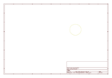

# OOMP Project  
## kicad_component_layout  by devbisme  
  
(snippet of original readme)  
  
- Kicad Component Layout Plugin  
  
A python plugin for KiCad to assist with script driven component layout.  
  
-- How to install  
  
The `component_layout_plugin.py` file needs to be located into the KiCad script search path. For  
example, on linux, it could go in `~/.kicad/scripting`. In python 6.0.1 (and later?) you can go to  
`Tools->External Plugins->Open Plugins Directory` to find the location.  
Once there, the script should be available to run in KiCad under 'Tools -> External Pluging', or  
using the button on the toolbar.  
  
For Windows:  
  
The Windows version of KiCad packages its own internal copy of Python 2.7. To install the required YAML dependency, open a command prompt as administrator and type:  
  
```  
"C:\Program Files\KiCad\bin\python.exe" -m pip install pyyaml==5.2  
```  
  
-- How to use  
  
When run in pcbnew, the plugin reads information about how to position components on the board from  
the file `layout.yaml` located in the project directory. The data in layout yaml allows the plugin  
to change the layer (top/bottom), position, rotation, and footprint for the given module.  
  
An example layout.yaml file:  
  
```  
    origin: [x0, y0] - Offset applied to all component locations  
    components:  
        R1:  
            location: [x, y] - mm  
            rotation: r - degrees (float)  
            flip: false  
            footprint:  
                path: path/to/library.pretty  
                name: SomeFootprint  
        J1:  
            ...  
```  
  
All the fields are optional for each component (e.  
  full source readme at [readme_src.md](readme_src.md)  
  
source repo at: [https://github.com/devbisme/kicad_component_layout](https://github.com/devbisme/kicad_component_layout)  
## Board  
  
[](working_3d.png)  
## Schematic  
  
[](working_schematic.png)  
  
[schematic pdf](working_schematic.pdf)  
## Images  
  
[](working_3d.png)  
  
[](working_3d_back.png)  
  
[](working_3D_bottom.png)  
  
[](working_3d_front.png)  
  
[](working_3D_top.png)  
  
[](working_assembly_page_01.png)  
  
[](working_assembly_page_02.png)  
  
[](working_assembly_page_03.png)  
  
[](working_assembly_page_04.png)  
  
[](working_assembly_page_05.png)  
  
[](working_assembly_page_06.png)  
