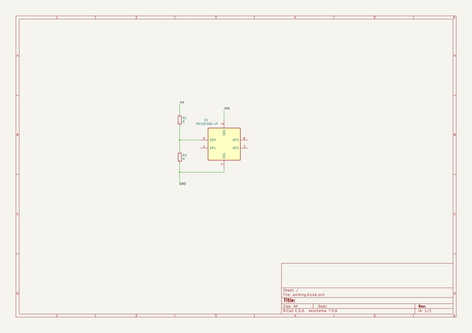

# OOMP Project  
## KiCon  by devbisme  
  
(snippet of original readme)  
  
- KiCon Presentation(s)  
  
This repo stores my presentation given at [KiCon 2019](https://kicad-kicon.com/).  
In the unlikely event I give further presentations, they will go here as well.  
  
  full source readme at [readme_src.md](readme_src.md)  
  
source repo at: [https://github.com/devbisme/KiCon](https://github.com/devbisme/KiCon)  
## Board  
  
  
## Schematic  
  
  
  
[schematic pdf](working_schematic.pdf)  
## Images  
  
  
  
  
  
  
