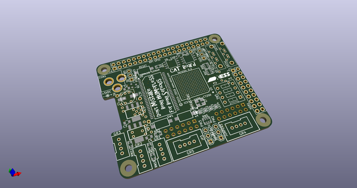

# OOMP Project  
## PadPainter  by devbisme  
  
(snippet of original readme)  
  
- PadPainter Plugin  
  
This PCBNEW plugin identifies pins that meet specified criteria and highlights  
the associated pads on the PCB.  
This is helpful for identifying sets of related pins when physically planning  
the layout of high pin-count packages such as FPGAs.  
  
* Free software: MIT license  
  
  
-- Features  
  
* Highlights selected pads in one or more footprints of a PCB.  
* Footprints are selected using their part reference.  
* Pads within a footprint are filtered by their numbers, names, pin function (e.g., input, output, bidirectional),  
  and unit (for multi-unit parts such as I/O banks in an FPGA).  
  
  
-- Installation  
  
Just copy `PadPainter.py` to the `kicad/share/kicad/scripting/plugins` directory.  
  
  
-- Usage  
  
The plugin is started by pressing the `Tools => External Plugins... => PadPainter` button.  
This brings up the following window:  
  
  
  
--- Netlist File Field  
  
The `Netlist File` field is used to specify the netlist associated with the PCB.  
This is used to determine the pin names and electrical properties of the pads  
in the PCB footprints.  
  
Upon startup, PadPainter will populate this field with a file name based on   
the PCB file name with a `.net` extension. You are free to change this by   
typing a new name, selecting a new file using the file browser, or by   
dragging a new netlist file into the field.  
   
--- Parts Field  
  
The parts whose pads will be highlighted are specified as a comma-separated list  
of part reference IDs in the `Parts` field.  
  
  full source readme at [readme_src.md](readme_src.md)  
  
source repo at: [https://github.com/devbisme/PadPainter](https://github.com/devbisme/PadPainter)  
## Board  
  
  
## Schematic  
  
  
  
[schematic pdf](working_schematic.pdf)  
## Images  
  
  
  
  
  
  
