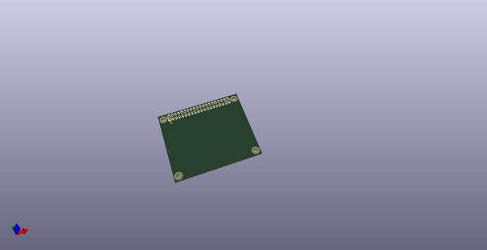
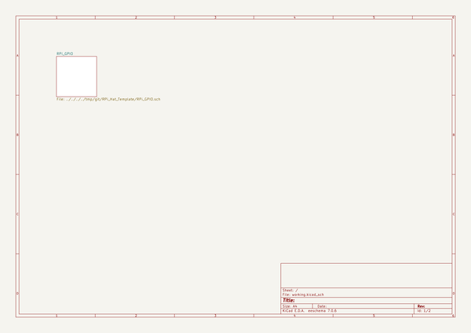
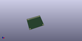
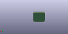
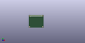

# OOMP Project  
## RPi_Hat_Template  by devbisme  
  
oomp key: oomp_projects_flat_devbisme_rpi_hat_template  
(snippet of original readme)  
  
% RPi B+ Hat  
  
Raspberry Pi B+ Hat  
============================  
  
Expansion Board  
----------------------------  
  
This is a project template for a   
[Raspberry Pi B+ Hat](https://github.com/raspberrypi/hats).  
  
This base project includes a PCB edge defined according to   
[this specification](https://github.com/raspberrypi/hats/blob/master/hat-board-mechanical.pdf).  
Both a thru-hole and a surface mount connector are provided, along with a different  
PCB edge for each. Just keep the PCB edge and connector type that you're using for your design  
and delete the others.  
  
The component footprints used in this template are [here](https://github.com/devbisme/RPi_Hat.pretty).  
  
The board outline looks like this:  
  
  
  
Using the Template  
----------------------------  
  
To use the Raspberry Pi Hat template with the through-hole connector, do the following:  
  
1. Open the schematic. Remove the SMD connector, J1.  
2. Generate the schematic netlist.  
3. Generate the .cmp file. (The J2 connector will be the only component in it.)  
4. Open the PCB. Hover your mouse over the connector and hit **e** to edit it. Select the J1 SMD connector. In the **Move and Place** section of the **Footprint Properties** window, select the **Free** radio button. Then click **OK**. The SMD connector should now be unlocked so it can be removed.  
5. Read in the netlist from the schematic. In the **Extra Footprints** section of the **Netlist** dialog window, select the **Delete** radio button. The  
  full source readme at [readme_src.md](readme_src.md)  
  
source repo at: [https://github.com/devbisme/RPi_Hat_Template](https://github.com/devbisme/RPi_Hat_Template)  
## Board  
  
  
## Schematic  
  
  
  
[schematic pdf](working_schematic.pdf)  
## Images  
  
  
  
  
  
  
