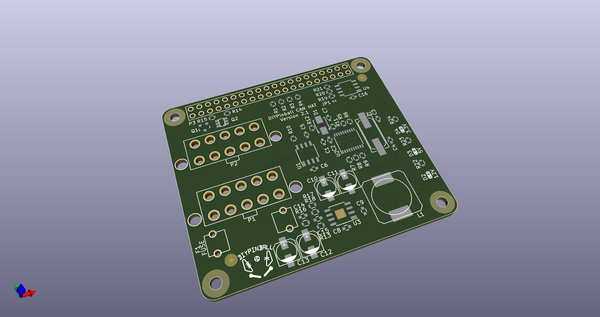
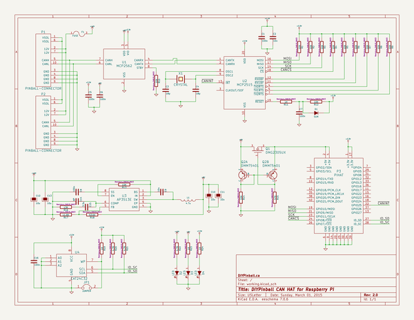
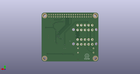
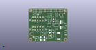

# OOMP Project  
## can-hat  by diypinball  
  
oomp key: oomp_projects_flat_diypinball_can_hat  
(snippet of original readme)  
  
- can-hat  
CAN HAT for a Raspberry Pi  
  
  full source readme at [readme_src.md](readme_src.md)  
  
source repo at: [https://github.com/diypinball/can-hat](https://github.com/diypinball/can-hat)  
## Board  
  
  
## Schematic  
  
  
  
[schematic pdf](working_schematic.pdf)  
## Images  
  
  
  
  
  
  
