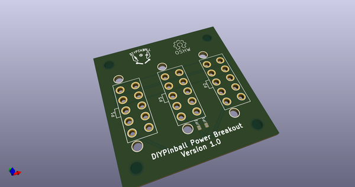
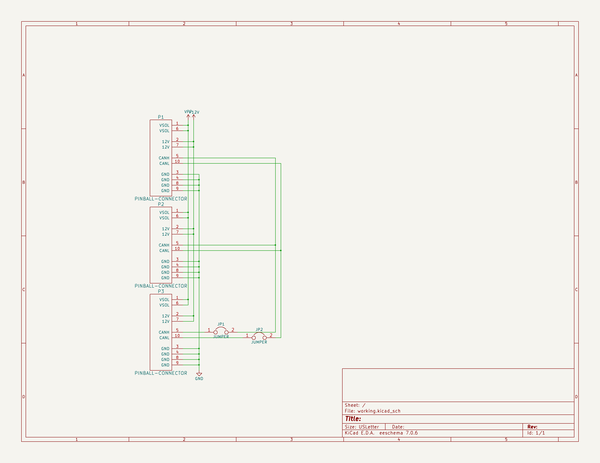
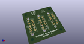
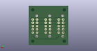
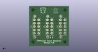

# OOMP Project  
## power-breakout  by diypinball  
  
(snippet of original readme)  
  
- power-breakout  
Power Breakout board for DIYPinball. Allows other systems to tap into 12V and Solenoid power without creating a messier cable system.  
  
  full source readme at [readme_src.md](readme_src.md)  
  
source repo at: [https://github.com/diypinball/power-breakout](https://github.com/diypinball/power-breakout)  
## Board  
  
  
## Schematic  
  
  
  
[schematic pdf](working_schematic.pdf)  
## Images  
  
  
  
  
  
  
