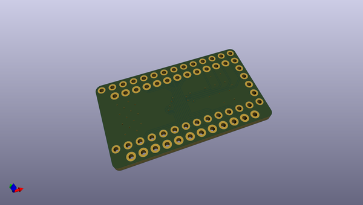
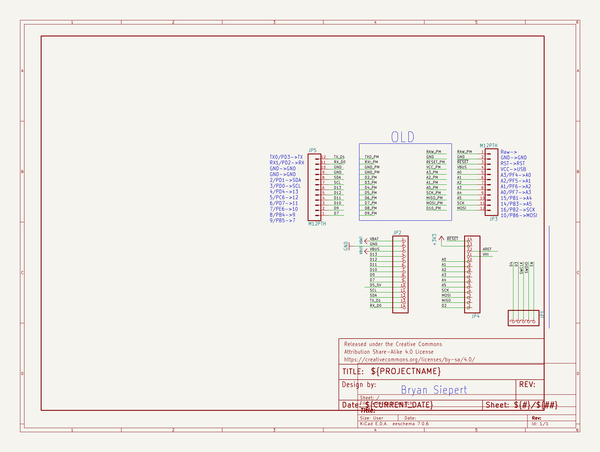

# OOMP Project  
## kmk_firmware  by DonutCables  
  
oomp key: oomp_projects_flat_donutcables_kmk_firmware  
(snippet of original readme)  
  
- KMK: Clackety Keyboards Powered by Python  
  
  
  
  
  
  
KMK is a feature-rich and beginner-friendly firmware for computer keyboards  
written and configured in  
[CircuitPython](https://github.com/adafruit/circuitpython).  
  
-- Support  
  
For asynchronous support and chatter about KMK, [join our Zulip  
community](https://kmkfw.zulipchat.com)!  
  
If you ask for help in chat or open a bug report, if possible  
make sure your copy of KMK is up-to-date.  
In particular, swing by the Zulip chat *before* opening a GitHub Issue about  
configuration, documentation, etc. concerns.  
  
> The former Matrix and Discord rooms once linked to in this README are no  
> longer officially supported, please do not use them!  
  
-- Features  
  
- Fully configured through a single, easy to understand Python file that lives  
  on a "flash-drive"-esque space on your microcontroller - edit on the go  
  without DFU or other devtooling available!  
- Single-piece or [two-piece split  
  keyboards](/docs/en/split_keyboards.md)  
  are supported  
- [Chainable  
  keys](/docs/en/keys.md) such as  
  `KC.LWIN(KC.L)` to lock the screen on a Windows PC  
- [Built-in U  
  full source readme at [readme_src.md](readme_src.md)  
  
source repo at: [https://github.com/DonutCables/kmk_firmware](https://github.com/DonutCables/kmk_firmware)  
## Board  
  
  
## Schematic  
  
  
  
[schematic pdf](working_schematic.pdf)  
## Images  
