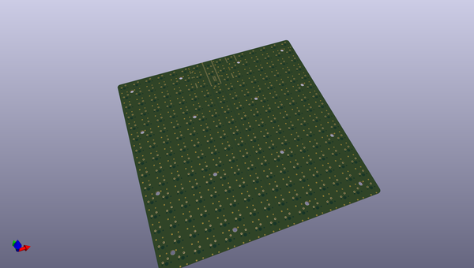
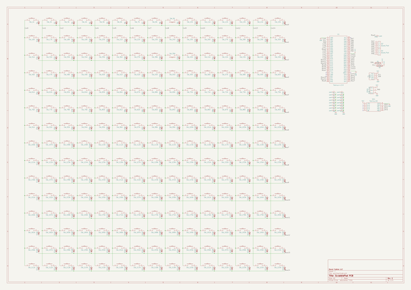

# OOMP Project  
## ScrabblePad-Kicad-Files  by DonutCables  
  
oomp key: oomp_projects_flat_donutcables_scrabblepad_kicad_files  
(snippet of original readme)  
  
- ScrabblePad_Kicad_Files  
 Kicad-specific files for ScrabblePad  
  
  full source readme at [readme_src.md](readme_src.md)  
  
source repo at: [https://github.com/DonutCables/ScrabblePad-Kicad-Files](https://github.com/DonutCables/ScrabblePad-Kicad-Files)  
## Board  
  
  
## Schematic  
  
  
  
[schematic pdf](working_schematic.pdf)  
## Images  
