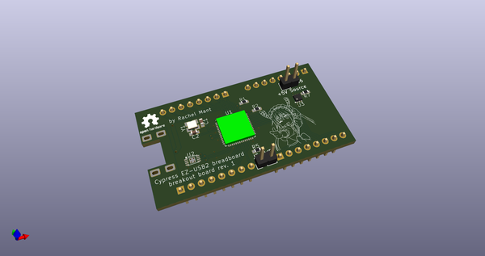
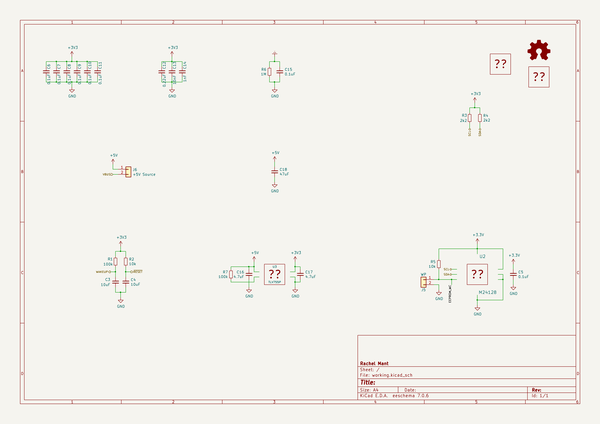
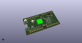
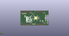
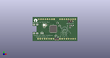

# OOMP Project  
## CY7CBreakout  by dragonmux  
  
oomp key: oomp_projects_flat_dragonmux_cy7cbreakout  
(snippet of original readme)  
  
- CY7CBreakout  
  
CY7CBreakout is a breadboard-compatible Cypress CY7C68013A breakout board.  
  
This project is licensed under the CERN OHL v.1.2 or later.  
  
  full source readme at [readme_src.md](readme_src.md)  
  
source repo at: [https://github.com/dragonmux/CY7CBreakout](https://github.com/dragonmux/CY7CBreakout)  
## Board  
  
  
## Schematic  
  
  
  
[schematic pdf](working_schematic.pdf)  
## Images  
  
  
  
  
  
  
