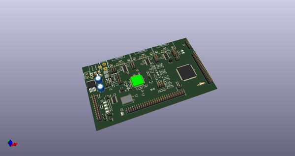
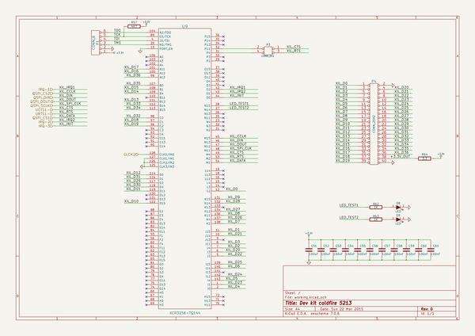
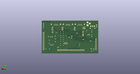
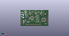

# OOMP Project  
## kicad-color-schemes  by dragonmux  
  
(snippet of original readme)  
  
- kicad-color-schemes  
  
Want to change the color scheme of KiCad? Look here for inspiration.  
  
-- Install Color Themes using the PCM (KiCad 5.99 demo feature)  
  
If you run KiCad 5.99 which was build including the new Plugin and Content Manager (using the compile option `-DKICAD_PCM=ON`), you can simply add the repository url and install the themes inside KiCad:  
- https://raw.githubusercontent.com/pointhi/kicad-color-schemes/master/repository.json  
  
-- How to use a colour theme.  
  
Every theme directory contains the colour definition parts of the eeschema and pcbnew setup files found in your personal profile.  
- For Linux under ~.config/kicad/  
- Windows XP: “C:\Documents and Settings\username\Application Data” + kicad (= %APPDATA%\kicad)  
- Windows Vista & later: “C:\Users\username\AppData\Roaming” + kicad (= %APPDATA%\kicad)  
- OSX: The user’s home directory + /Library/Preferences/kicad  
  
Use a text editor to overwrite the relevant sections with the data found in the files in this folder. **Make sure you create a backup first.**  
  
The pcbnew config file content has been split into the sections responsible for the footprint editor and the one for pcbnew. This is done to allow you to more easily mix and match different schemes for different tools.  
  
-- Automatic patcher  
  
An automatic patch script can be used to transfer a colour scheme into your KiCad settings files. Make sure KiCad is closed before using it.  
  
The script expects the directory containing the colour scheme and the kicad conf  
  full source readme at [readme_src.md](readme_src.md)  
  
source repo at: [https://github.com/dragonmux/kicad-color-schemes](https://github.com/dragonmux/kicad-color-schemes)  
## Board  
  
  
## Schematic  
  
  
  
[schematic pdf](working_schematic.pdf)  
## Images  
  
  
  
  
  
  
