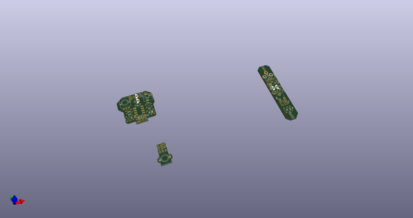
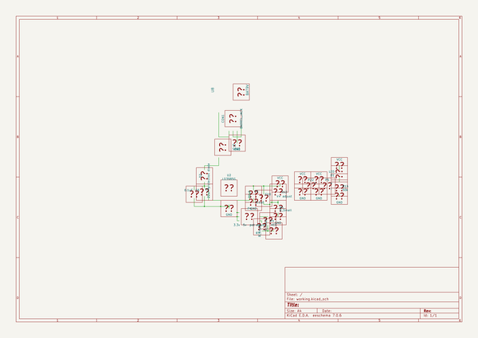
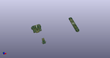
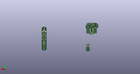
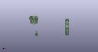

# OOMP Project  
## Breadboard_Breakouts  by Drc3p0  
  
(snippet of original readme)  
  
- Breadboard_Breakouts  
  full source readme at [readme_src.md](readme_src.md)  
  
source repo at: [https://github.com/Drc3p0/Breadboard_Breakouts](https://github.com/Drc3p0/Breadboard_Breakouts)  
## Board  
  
  
## Schematic  
  
  
  
[schematic pdf](working_schematic.pdf)  
## Images  
  
  
  
  
  
  
